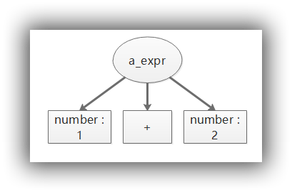
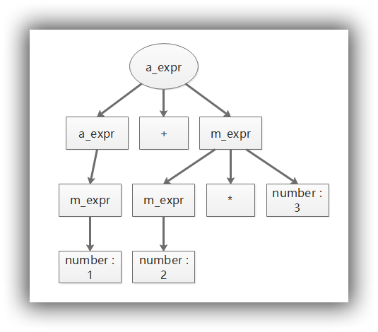

# Python BNF

[TOC]

> BNF (Backus Normal Form) is a [notation technique](https://en.wikipedia.org/wiki/Metasyntax) for [context-free grammars](https://en.wikipedia.org/wiki/Context-free_grammar), often used to describe the [syntax](https://en.wikipedia.org/wiki/Syntax_(programming_languages)) of [languages](https://en.wikipedia.org/wiki/Formal_language#Programming_languages) used in computing. -- [维基百科](https://en.wikipedia.org/wiki/Backus%E2%80%93Naur_form)

《Python 语言手册》中使用了修改版的 BNF 文法(grammar)标记，来描述相关词法(lexical)和句法(syntax) 。《语言手册》中的相关描述位于 [1.2. Notation](https://docs.python.org/3.6/reference/introduction.html#notation) 中。本文将这种修改版的 BNF 称作 **PyBNF**。

Python 程序通过解析器 (parser) 读取。由词法分析器(*lexical analyzer*)生成的语言符号(*tokens*)流会被输入到解析器中。解析器的工作是理解语言符号间的关系，词法和句法便是是描述这些关系的规则。

## PyBNF 符号约定

为了理解 PyBNF 中各种符号的含义，这里以字符串字面值的词法定义为例：

```
stringliteral   ::=  [stringprefix](shortstring | longstring)
stringprefix    ::=  "r" | "u" | "R" | "U" | "f" | "F"
                     | "fr" | "Fr" | "fR" | "FR" | "rf" | "rF" | "Rf" | "RF"
shortstring     ::=  "'" shortstringitem* "'" | '"' shortstringitem* '"'
longstring      ::=  "'''" longstringitem* "'''" | '"""' longstringitem* '"""'
shortstringitem ::=  shortstringchar | stringescapeseq
longstringitem  ::=  longstringchar | stringescapeseq
shortstringchar ::=  <any source character except "\" or newline or the quote>
longstringchar  ::=  <any source character except "\">
stringescapeseq ::=  "\" <any source character>
```

符号约定如下：

- 每条规则以名字(这条规则定义的名字)和 `::=` 作为开头。
- 竖线 (`|`) 用于分隔可相互替换的内容；`|` 是这种标记法中优先级最低的符号。比如， `"'" shortstringitem* "'"` 与 `'"' shortstringitem* '"'` 便属于可互换选项。规则通常会被包含在单独的一行中，拥有多个可互换项的规则可能会被格式化为多行，每一行表示一个可互换项并以 `|` 开头。

- 星号 (`*`) 意味着对前一项的零或多次重复。
- 加号 (`+`) 意味着对前一项至少重复一次，`*` 和 `+` 运算符具有最高的优先级。
- 方括号 (`[]`) 中的词组(phrase)会发生零次或一次(或说，括号内的词组是可选的)。
- 圆括号 (`()`)用于分组。
- 字符串字面量会被放在双引号中 (`""`) 。
- 空白符 (  ) 仅在分隔符号(tokens)时有意义。

在词法定义中，还使用了两个额外的约定：

- 被三个点号 `...` 分隔开的字符字面量表示在给定的 ASCII 字符范围内，可任选一个字符(选择范围包含已给定的两个字符)。
- 在尖括号 (`<...>`) 中给出的短语(phrase) 用于给出符号定义的非正式描述。

## 如何理解句法定义

PyBNF 在词法(lexical)和句法(syntactic)定义中几乎使用了相同的标记法，但具体意义仍有较大区别：词法定义了对输入源的每个字符的操作，语法定义了对由词法分析生成的符号(tokens)流的操作。词法定义主要位于 [2. Lexical analysis](https://docs.python.org/3.6/reference/lexical_analysis.html) 且很容易理解，这里主要解释如何理解句法定义。

首先，当某个句法拥有形如 `name ::=  othername` 的规则时—— 也可能是众多并列项中的某个具有这种形式 —— 则表明在此项规则下 `name` 拥有与 `othername` 相同的语义。

由于《语言手册》中的定义较为复杂，所以这里为了便于理解，会自建一组语法定义。注意该组定义并不存在于《语言手册》中，仅仅是为了便于理解整个过程，而人为给出的示例。

首先，定义一组二元加法运算：

```
a_expr ::= number '+' number | number '-' number
number ::=  1 | 2 | 3 | 4 | 5 | 6 | 7 | 8 | 9 | 0
```

如果在解释器中输入 `1 + 2`  ，便会产生以下语言符号(token) ：`number '+' number` 。

树形图如下：



如果想要处理更长的指令，比如 `1 + 2 + 3` ，则需要将定义修改为：

```
a_expr ::= number | a_expr '+' number | a_expr '-' number
number ::=  1 | 2 | 3 | 4 | 5 | 6 | 7 | 8 | 9 | 0
```

树形图如下：


如果还想处理更加复杂的表达式，比如 `1 + 2 * 3` ，则需要将定义修改为：

```
m_expr ::= number | m_expr '*' number
a_expr ::= m_expr | a_expr '+' m_expr | a_expr '-' m_expr
number ::=  1 | 2 | 3 | 4 | 5 | 6 | 7 | 8 | 9 | 0
```

树形图如下：



## 参考

https://yaobinwen.github.io/archive/2017/02/21/Understanding-python-BNF/

https://github.com/leonardoaraujosantos/Matlab_LLVM_Frontend/issues/3

未读：

https://kb.cnblogs.com/page/189566/

https://pythonhosted.org/pyrser/dsl.html

http://matt.might.net/articles/grammars-bnf-ebnf/

http://cui.unige.ch/isi/bnf/AboutBNF.html#Marcotty86

