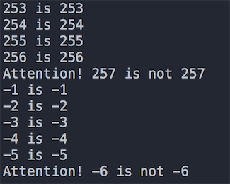
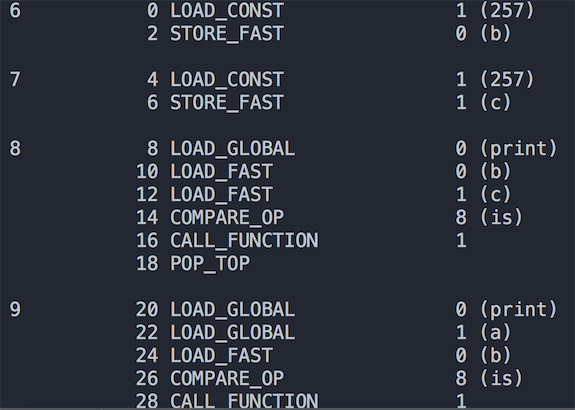

# 0x04-1 数值类型的坑
> GitHub@[orca-j35](https://github.com/orca-j35)，所有笔记均托管于 [python_notes](https://github.com/orca-j35/python_notes) 仓库

### 坑1 - 整数比较的坑

> 参考: [Python-100-Days](https://github.com/jackfrued/Python-100-Days) -> ﹝那些年我们踩过的那些坑.md﹞

在 Python 中一切都是对象，整数也是对象，在比较两个整数时有两个运算符`==`和`is`，它们的区别是：

- `is`比较的是两个整数对象的id值是否相等，也就是比较两个引用是否代表了内存中同一个地址。
- `==`比较的是两个整数对象的内容是否相等，使用`==`时其实是调用了对象的`__eq__()`方法。

知道了`is`和`==`的区别之后，我们可以来看看下面的代码，了解Python中整数比较有哪些坑：

```Python
def main():
	x = y = -1
	while True:
		x += 1
		y += 1
		if x is y:
			print('%d is %d' % (x, y))
		else:
			print('Attention! %d is not %d' % (x, y))
			break
			
	x = y = 0
	while True:
		x -= 1
		y -= 1
		if x is y:
			print('%d is %d' % (x, y))
		else:
			print('Attention! %d is not %d' % (x, y))
			break


if __name__ == '__main__':
	main()

```

上面代码的部分运行结果如下图所示，出现这个结果的原因是Python出于对性能的考虑所做的一项优化。对于整数对象，Python把一些频繁使用的整数对象缓存起来，保存到一个叫`small_ints`的链表中，在Python的整个生命周期内，任何需要引用这些整数对象的地方，都不再重新创建新的对象，而是直接引用缓存中的对象。Python把频繁使用的整数对象的值定在[-5, 256]这个区间，如果需要这个范围的整数，就直接从`small_ints`中获取引用而不是临时创建新的对象。因为大于256或小于-5的整数不在该范围之内，所以就算两个整数的值是一样，但它们是不同的对象。



当然仅仅如此这个坑就不值一提了，如果你理解了上面的规则，我们就再看看下面的代码。

```Python
import dis
a = 257


def main():
	b = 257  # 第6行
	c = 257  # 第7行
	print(b is c)  # True
	print(a is b)  # False
	print(a is c)  # False


if __name__ == "__main__":
	main()

```

程序的执行结果已经用注释写在代码上了。够坑吧！看上去`a`、`b`和`c`的值都是一样的，但是`is`运算的结果却不一样。为什么会出现这样的结果，首先我们来说说Python程序中的代码块。所谓代码块是程序的一个最小的基本执行单位，一个模块文件、一个函数体、一个类、交互式命令中的单行代码都叫做一个代码块。上面的代码由两个代码块构成，`a = 257`是一个代码块，`main`函数是另外一个代码块。Python内部为了进一步提高性能，凡是在一个代码块中创建的整数对象，如果值不在`small_ints`缓存范围之内，但在同一个代码块中已经存在一个值与其相同的整数对象了，那么就直接引用该对象，否则创建一个新的对象出来，这条规则对不在`small_ints`范围的负数并不适用，对负数值浮点数也不适用，但对非负浮点数和字符串都是适用的，这一点读者可以自行证明。所以 `b is c`返回了`True`，而`a`和`b`不在同一个代码块中，虽然值都是257，但却是两个不同的对象，`is`运算的结果自然是`False`了。
为了验证刚刚的结论，我们可以借用`dis`模块（听名字就知道是进行反汇编的模块）从字节码的角度来看看这段代码。如果不理解什么是字节码，可以先看看[《谈谈 Python 程序的运行原理》]((http://www.cnblogs.com/restran/p/4903056.html))这篇文章。可以先用`import dis`导入`dis`模块并按照如下所示的方式修改代码。

```Python
if __name__ == "__main__":
	main()
	dis.dis(main)

```

代码的执行结果如下图所示。可以看出代码第6行和第7行，也就是`main`函数中的257是从同一个位置加载的，因此是同一个对象；而代码第9行的`a`明显是从不同的地方加载的，因此引用的是不同的对象。



如果还想对这个问题进行进一步深挖，推荐大家阅读[《Python整数对象实现原理》](https://foofish.net/python_int_implement.html)这篇文章。