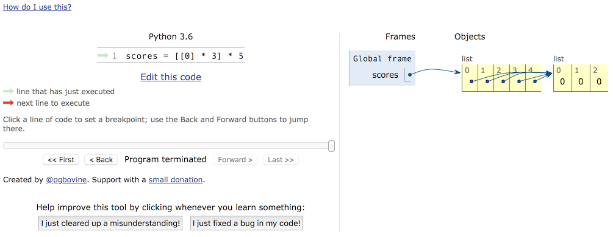
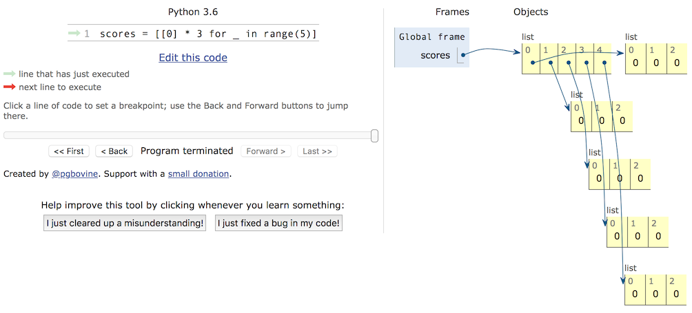

# 0x07-1 序列的坑
> GitHub@[orca-j35](https://github.com/orca-j35)，所有笔记均托管于 [python_notes](https://github.com/orca-j35/python_notes) 仓库

##  嵌套列表的坑

> 参考: [Python-100-Days](https://github.com/jackfrued/Python-100-Days) -> ﹝那些年我们踩过的那些坑.md﹞

Python中有一种内置的数据类型叫列表，它是一种容器，可以用来承载其他的对象（准确的说是其他对象的引用），列表中的对象可以称为列表的元素，很明显我们可以把列表作为列表中的元素，这就是所谓的嵌套列表。嵌套列表可以模拟出现实中的表格、矩阵、2D游戏的地图（如植物大战僵尸的花园）、棋盘（如国际象棋、黑白棋）等。但是在使用嵌套的列表时要小心，否则很可能遭遇非常尴尬的情况，下面是一个小例子。

```Python
def main():
	names = ['关羽', '张飞', '赵云', '马超', '黄忠']
	subjs = ['语文', '数学', '英语']
	scores = [[0] * 3] * 5
	for row, name in enumerate(names):
		print('请输入%s的成绩' % name)
		for col, subj in enumerate(subjs):
			scores[row][col] = float(input(subj + ': '))
	print(scores)


if __name__ == '__main__':
	main()

```

我们希望录入5个学生3门课程的成绩，于是定义了一个有5个元素的列表，而列表中的每个元素又是一个由3个元素构成的列表，这样一个列表的列表刚好跟一个表格是一致的，相当于有5行3列，接下来我们通过嵌套的for-in循环输入每个学生3门课程的成绩。程序执行完成后我们发现，每个学生3门课程的成绩是一模一样的，而且就是最后录入的那个学生的成绩。

要想把这个坑填平，我们首先要区分对象和对象的引用这两个概念，而要区分这两个概念，还得先说说内存中的栈和堆。我们经常会听人说起“堆栈”这个词，但实际上“堆”和“栈”是两个不同的概念。众所周知，一个程序运行时需要占用一些内存空间来存储数据和代码，那么这些内存从逻辑上又可以做进一步的划分。对底层语言（如C语言）有所了解的程序员大都知道，程序中可以使用的内存从逻辑上可以为五个部分，按照地址从高到低依次是：栈（stack）、堆（heap）、数据段（data segment）、只读数据段（static area）和代码段（code segment）。其中，栈用来存储局部、临时变量，以及函数调用时保存现场和恢复现场需要用到的数据，这部分内存在代码块开始执行时自动分配，代码块执行结束时自动释放，通常由编译器自动管理；堆的大小不固定，可以动态的分配和回收，因此如果程序中有大量的数据需要处理，这些数据通常都放在堆上，如果堆空间没有正确的被释放会引发内存泄露的问题，而像Python、Java等编程语言都使用了垃圾回收机制来实现自动化的内存管理（自动回收不再使用的堆空间）。所以下面的代码中，变量`a`并不是真正的对象，它是对象的引用，相当于记录了对象在堆空间的地址，通过这个地址我们可以访问到对应的对象；同理，变量`b`是列表容器的引用，它引用了堆空间上的列表容器，而列表容器中并没有保存真正的对象，它保存的也仅仅是对象的引用。

```Python
a = object()
b = ['apple', 'pitaya', 'grape']
```

知道了这一点，我们可以回过头看看刚才的程序，我们对列表进行`[[0] * 3] * 5`操作时，仅仅是将`[0, 0, 0]`这个列表的地址进行了复制，并没有创建新的列表对象，所以容器中虽然有5个元素，但是这5个元素引用了同一个列表对象，这一点可以通过`id`函数检查`scores[0]`和`scores[1]`的地址得到证实。所以正确的代码应该按照如下的方式进行修改。

```Python
def main():
	names = ['关羽', '张飞', '赵云', '马超', '黄忠']
	subjs = ['语文', '数学', '英语']
	scores = [[]] * 5
	for row, name in enumerate(names):
		print('请输入%s的成绩' % name)
		scores[row] = [0] * 3
		for col, subj in enumerate(subjs):
			scores[row][col] = float(input(subj + ': '))
	print(scores)


if __name__ == '__main__':
	main()

```

或者

```Python
def main():
	names = ['关羽', '张飞', '赵云', '马超', '黄忠']
	subjs = ['语文', '数学', '英语']
	scores = [[0] * 3 for _ in range(5)]
	for row, name in enumerate(names):
		print('请输入%s的成绩' % name)
		scores[row] = [0] * 3
		for col, subj in enumerate(subjs):
			scores[row][col] = float(input(subj + ': '))
	print(scores)


if __name__ == '__main__':
	main()

```

如果对内存的使用不是很理解，可以看看[PythonTutor网站](http://www.pythontutor.com/)上提供的代码可视化执行功能，通过可视化执行，我们可以看到内存是如何分配的，从而避免在使用嵌套列表或者复制对象时可能遇到的坑。






