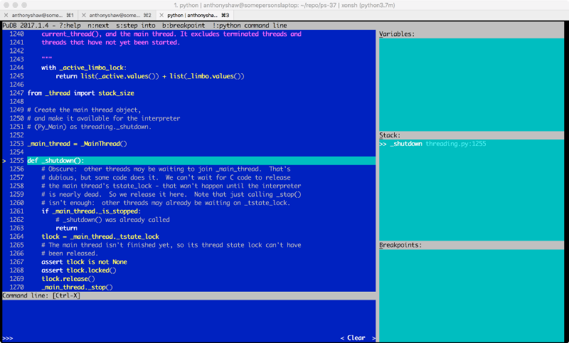
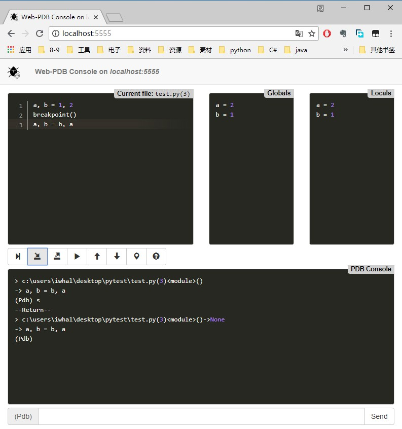

# breakpoint

[TOC]

New in version 3.7.

## 1. how2 [Implementation](https://www.python.org/dev/peps/pep-0553/#id12)

虽然 `breakpoint` 是由 C 语言实现的 ，但我们可以使用  Python pseudo-code 来描述其实现过程：

```python
# In builtins.
def breakpoint(*args, **kws):
    import sys
    missing = object()
    hook = getattr(sys, 'breakpointhook', missing)
    if hook is missing:
        raise RuntimeError('lost sys.breakpointhook')
    return hook(*args, **kws)

# In sys.
def breakpointhook(*args, **kws):
    import importlib, os, warnings
    hookname = os.getenv('PYTHONBREAKPOINT')
    if hookname is None or len(hookname) == 0:
        hookname = 'pdb.set_trace'
    elif hookname == '0':
        return None
    modname, dot, funcname = hookname.rpartition('.')
    if dot == '':
        modname = 'builtins'
    try:
        module = importlib.import_module(modname)
        hook = getattr(module, funcname)
    except:
        warnings.warn(
            'Ignoring unimportable $PYTHONBREAKPOINT: {}'.format(
                hookname),
            RuntimeWarning)
    return hook(*args, **kws)

__breakpointhook__ = breakpointhook
```

## 2. how2 work

在未设置 `PYTHONBREAKPOINT` 的情况下，`breakpoint()` 会中断当前程序并进入 [`pdb`](https://docs.python.org/3/library/pdb.html#module-pdb) 调试器。具体工作方式请查看相应子章节。

### 2.1 breakpoint()

🔨 breakpoint(\**args*, \*\**kws*)

伪代码：

```python
# In builtins.
def breakpoint(*args, **kws):
    import sys
    missing = object()
    # 设置钩子函数
    hook = getattr(sys, 'breakpointhook', missing)
    if hook is missing:
        raise RuntimeError('lost sys.breakpointhook')
    # 返回钩子函数的调用
    return hook(*args, **kws)
```

可见 `breakpoint` 的工作仅是设置并调用 hook 函数，这里只需要注意以下几点：

- `breakpoint` 中的 hook 变量将引用 `sys.breakpointhook` 函数对象；
- `breakpoint` 会将自己所有的实参都传递给 `sys.breakpointhook()`；
- 如果 `sys.breakpointhook` 缺失，则会抛出 `RuntimeError`

### 2.2 breakpointhook()

🔨 sys.breakpointhook(\**args*, \*\**kws*)

伪代码：

```python
# In sys.
def breakpointhook(*args, **kws):
    import importlib, os, warnings
    hookname = os.getenv('PYTHONBREAKPOINT')
    if hookname is None or len(hookname) == 0:
        hookname = 'pdb.set_trace'
    elif hookname == '0':
        return None
    modname, dot, funcname = hookname.rpartition('.')
    if dot == '':
        modname = 'builtins'
    try:
        # 模块导入失败，或funcname不可调用都会引发RuntimeWarning
        module = importlib.import_module(modname)
        hook = getattr(module, funcname)
    except:
        # 如果抛出异常，则不会执行hook(*args, **kws)
        warnings.warn(
            'Ignoring unimportable $PYTHONBREAKPOINT: {}'.format(
                hookname),
            RuntimeWarning)
    # 如果实参与函数签名中的参数不匹配，则会抛出TypeError
    return hook(*args, **kws) 

__breakpointhook__ = breakpointhook
```

`sys.breakpointhook` 作为 `breakpoint` 的钩子函数，是正真实现具体功能的地方。

`sys.breakpointhook`  会访问环境变量 `PYTHONBREAKPOINT`，从而确定 hook 的引用对象，也就是说 `PYTHONBREAKPOINT` 的状态对执行结果有决定性的作用。

具体而言，`PYTHONBREAKPOINT` 存在如下几种状态：

- **完全不设置该环境变量**：此时，hook 会引用 [`pdb.set_trace`](https://docs.python.org/3.7/library/pdb.html#pdb.set_trace)，所以最终会进入 [`pdb`](https://docs.python.org/3/library/pdb.html#module-pdb) 调试器。(提示，由于 `pdb.set_trace(*, header=None)` 只接受关键字参数 `header`，因此不要向 `breakpoint()` 传递任何其它参数)
- `PYTHONBREAKPOINT=`：此时，环境变量的值为空字符串，这与**完全不设置该环境变量**的效果相同。
- `PYTHONBREAKPOINT=0`：此时，`breakpointhook` 会立即返回 `None`，从而禁用调试；
- `PYTHONBREAKPOINT=some.importable.callable`：此时，`breakpointhook()` 将导入 `some.importable` 模块，然后通过 hook 引用模块中的 `callable` 对象
- `PYTHONBREAKPOINT=callable`：此时，`callable` 表示一个内置可调用对象，如 `PYTHONBREAKPOINT=print`。

每次调用 `sys.breakpointhook()` 时，都会访问 `PYTHONBREAKPOINT` 变量。如果在程序执行期间改变了 `PYTHONBREAKPOINT` 的值， `sys.breakpointhook()` 便会读取变化后的值。因此，程序可以执行如下操作：

```python
os.environ['PYTHONBREAKPOINT'] = 'foo.bar.baz'
breakpoint()    # Imports foo.bar and calls foo.bar.baz()
```

注意：如果在解释器启动时伴随参数 `-E`，便会忽略所有 `PYTHON*` 环境变量(`PYTHONBREAKPOINT` 也不列外)。这意味着`breakpoint()` 会遵守默认行为，即中断当前程序并进入 [`pdb`](https://docs.python.org/3/library/pdb.html#module-pdb) 调试器。

### 2.3 \_\_breakpointhook\_\_

```python
# In sys.
__breakpointhook__ = breakpointhook
```

在初始化时 ，`__breakpointhook__` 和 `breakpointhook` 会引用相同的函数对象。因此，就算重写了 `breakpointhook` 函数，也可通过 `__breakpointhook__` 将其重置：

```python
# 重置 breakpointhook 
sys.breakpointhook = sys.__breakpointhook__
```

`sys.breakpointhook` / `sys.__breakpointhook__` 工作方式与  `sys.displayhook()` / `sys.__displayhook__` 和 `sys.excepthook()` / `sys.__excepthook__` 完全相同。

## 3. with pdb.set_trace

在使用 [`pdb`](https://docs.python.org/3/library/pdb.html#module-pdb) 调试器时，我们通常会这样设置断点：

```python
def divide(e, f):
    # 设置一个断点，执行至此处后，便会中断当前程序并进入pdb调试器。
    import pdb; pdb.set_trace()
    return f / e
```

在 Python 3.7 中，我们可以通过 `breakpoint()` 函数来设置断点(前提是未定义 `PYTHONBREAKPOINT`环境变量，或该环境变量的值等于空字符串)。

```python
"""file_name:bugs.py"""
def divide(e, f):
    breakpoint(header="进入调试器")
    return e / f

a, b = 1, 9
print(divide(a, b))
```

此时，`breakpointhook()` 会返回 `pdb.set_trace()` ，从而进入 [`pdb`](https://docs.python.org/3/library/pdb.html#module-pdb) 调试器。

Tips：在 Python 3.7 中，`pdb.set_trace` 仅支持关键字参数 `header`，不接受其他任何参数。如果传递了错误的参数，便会引发 `TypeError` 。

bugs.py 的执行效果如下：

```bash
$ python.exe bugs.py
进入调试器
> c:\users\iwhal\desktop\pytest\bugs.py(3)divide()
-> return e / f
(Pdb) p a+b
10
(Pdb) c
0.1111111111111111
```

Tips：命令 `p` 用于查看表达式的值；命令 `c` 用于退出调试器，并继续执行程序。

## 4. with pudb.set_trace

通过 `PYTHONBREAKPOINT` 还可选用别的调试器。例如，当我们想要使用  [PuDB](https://pypi.org/project/pudb/) (一个基于控制台的可视化调试器)时，只需修改 `PYTHONBREAKPOINT` ：

```bash
$ PYTHONBREAKPOINT=pudb.set_trace python3.7 bugs.py
```

注意：这里需要手动安装 pudb (`pip install pudb`)，并且 pudb 仅支持类 UNIX 环境。由于我是 windows 环境，所以无法进行更详细的演示。

总之，通过修改`PYTHONBREAKPOINT` 的值，我们可以选择自己需要的调试器。但是同样需要注意的是：通过 `breakpoint` 传递的参数，是否与调试器的函数签名匹配。



## 5. with web_pdb.set_trace

如果想要使用 [Web-PDB](https://pypi.org/project/web-pdb/) (Web-PDB 在内置 [PDB](https://docs.python.org/3.6/library/pdb.html) 上增加了 web 界面，并允许在 web 浏览器中远程调试 Python 脚本)，同样只需修改 `PYTHONBREAKPOINT`。注意：这里需要手动安装 web-pdb (`pip install web-pdb`)。

为了方便演示，先创建一个小脚本：

```python
"""file_name:test.py"""
a, b = 1, 2
breakpoint()
a, b = b, a
```

修改 `PYTHONBREAKPOINT` ，并执行脚本：

```bash
$ PYTHONBREAKPOINT=web_pdb.set_trace python.exe test.py
2018-08-23 10:54:05,108: root - web_console:110 - CRITICAL - Web-PDB: starting web-server on LAPTOP-AR0R702R:5555...
```

之后便可通过浏览器，在 5555 端口上进入 Web-PDB 调试器：



## 6. with IPython.embed

`breakpoint` 函数不仅适用于调试器，也适用于任何可调用对象，只要参数匹配即可。因此，当我们想要在程序执行过程中，启动一个交互式 shell 时(比如 IPython)，同样只需修改 `PYTHONBREAKPOINT`，如下：

```shell
$ PYTHONBREAKPOINT=IPython.embed python3.7 bugs.py
Python 3.7.0 (v3.7.0:1bf9cc5093, Jun 27 2018, 04:59:51) [MSC v.1914 64 bit (AMD64)]
Type 'copyright', 'credits' or 'license' for more information
IPython 6.5.0 -- An enhanced Interactive Python. Type '?' for help.

进入调试器

In [1]: a,b
Out[1]: (1, 9)

In [2]: quit()

0.1111111111111111
```

### 6.1 what's IPython.embed

[ipython-embed](http://ipython.readthedocs.io/en/stable/api/generated/IPython.terminal.embed.html)

`IPython.embed(**kwargs)` 会在程序的当前运行位置嵌入 IPython。在第一次调用该方法时，会先创建 `InteractiveShellEmbed` 类的一个实例，并调用该实例。再次调用该方法时，会直接调用之前创建的 `InteractiveShellEmbed` 实例。默认情况下，`InteractiveShellEmbed` 实例和当前程序使用相同的命名空间。另外，`IPython.embed` 允许我们在嵌入点打印指定字符串。

```python
"""file_name:test.py"""
from IPython import embed
a = 10
b = 20
embed(header='First time')# 会在嵌入点打印该字符串
c = 30
d = 40
embed()
```

执行 test.py 脚本后，会分两次进入 IPython：

```python
$ C:/Python37/python.exe c:/Users/iwhal/Desktop/PyTest/test.py
Python 3.7.0 (v3.7.0:1bf9cc5093, Jun 27 2018, 04:59:51) [MSC v.1914 64 bit (AMD64)]
Type 'copyright', 'credits' or 'license' for more information
IPython 6.5.0 -- An enhanced Interactive Python. Type '?' for help.


First time

In [1]: a,b
Out[1]: (10, 20)

In [2]: quit()

Python 3.7.0 (v3.7.0:1bf9cc5093, Jun 27 2018, 04:59:51) [MSC v.1914 64 bit (AMD64)]
Type 'copyright', 'credits' or 'license' for more information
IPython 6.5.0 -- An enhanced Interactive Python. Type '?' for help.

In [1]: a,b,c,d
Out[1]: (10, 20, 30, 40)

In [2]: quit()
```

## 7. with Functions

`breakpoint` 函数不仅适用于调试器，也适用于任何可调用对象。因此，我们可以通过 `breakpoint` 调用自定义函数，只要参数匹配即可。。

如下代码将创建一个可打印本地作用域内所有变量的函数：

```python
"""file_name:bp_utils.py"""
from pprint import pprint
import sys

def print_locals(header=None):
    print(header)
    caller = sys._getframe(1)  # Caller is 1 frame up.
    pprint(caller.f_locals)
```

只要合理设置 `PYTHONBREAKPOINT` 便可调用该函数：

```bash
$ PYTHONBREAKPOINT=bp_utils.print_locals python.exe bugs.py
First time
{'e': 1, 'f': 9}
0.1111111111111111
```

基于同样的思路，我们还可以调用内置函数，比如 `print` 函数。
先创建一个脚本，用于向内置传递传输，只需包含 `breakpoint` 即可：

```python
"""file_name:built_in.py"""
breakpoint("hello")
```

执行该脚本：

```python
$ PYTHONBREAKPOINT=print python3.7 built_in.py
hello
```

### 7.1 what's sys._getframe

[sys.\_getframe([*depth*])](https://docs.python.org/3.7/library/sys.html#sys._getframe)

从调用栈(call stack)中返回一个帧(frame)对象。如果给出了 *depth* 参数(需是整数)，则会返回栈顶下方对应深度的帧对象。如果 *depth* 值超过了调用栈的深度，将抛出 [`ValueError`](https://docs.python.org/3.7/library/exceptions.html#ValueError) 异常。*depth* 的默认值是 0，此时会返回调用栈最顶部的帧。

**CPython implementation detail:** 该函数仅用于内部和专门用途。并不保证在所有 Python 实现中都存在。

## 8. 参考

- [**PEP 553**](https://www.python.org/dev/peps/pep-0553) – Built-in breakpoint()
- [Python 3.7 中的新特性](https://pythonfun.top/cool-new-features-in-python-3.7-trp/)：编译自 [Cool New Features in Python 3.7](https://realpython.com/python37-new-features/)
- [Python 3.7’s new builtin breakpoint — a quick tour](https://hackernoon.com/python-3-7s-new-builtin-breakpoint-a-quick-tour-4f1aebc444c)
- [`breakpoint()` - Built-in Functions](https://docs.python.org/3.7/library/functions.html#breakpoint)
- [Built-in breakpoint()](https://docs.python.org/3/whatsnew/3.7.html#pep-553-built-in-breakpoint) - What's New In Python 3.7
- [sys.breakpointhook()](https://docs.python.org/3.7/library/sys.html#sys.breakpointhook) - 30.1. [`sys`](https://docs.python.org/3.7/library/sys.html#module-sys) — System-specific parameters and functions
- [sys.\_\_breakpointhook\_\_](https://docs.python.org/3.7/library/sys.html#sys.__breakpointhook__) - 30.1. [`sys`](https://docs.python.org/3.7/library/sys.html#module-sys) — System-specific parameters and functions
- [PYTHONBREAKPOINT](https://docs.python.org/3/using/cmdline.html#envvar-PYTHONBREAKPOINT) - 1. Command line and environment
- [ipython-embed](http://ipython.readthedocs.io/en/stable/api/generated/IPython.terminal.embed.html)
- [`pdb.set_trace()`](https://docs.python.org/3.7/library/pdb.html#pdb.set_trace)

