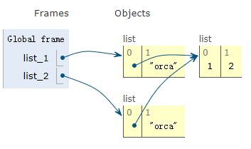

# list

```
class list(object)
 |  list() -> new empty list
 |  list(iterable) -> new list initialized from iterable's items
```

🔨*class* list([*iterable*])

该内置函数本质上是 [`list`](https://docs.python.org/3.7/library/stdtypes.html#list) 类的构造函数，用于创建 [`list`](https://docs.python.org/3.7/library/stdtypes.html#list) 实例。

如果没有向 list 函数传递任何参数，则会创建一个空列表：

```python
>>> list()
[]
```

如果向 list 函数传递一个可迭代对象，则会以 *iterable* 中的元素来构建一个新列表。新建列表中各个元素的值和顺序均与 *iterable* 中各个元素的值和顺序相同。*iterable* 可以是序列，也可是支持迭代的容器，还可以是迭代器对象。

```python
>>> list('abc')
['a', 'b', 'c']
>>> list( (1, 2, 3) )
[1, 2, 3]
>>> list(range(1,5))
[1, 2, 3, 4]
```

如果 *iterable* 本身就是一个列表对象，`list(iterable)` 则会返回该列表对象的浅拷贝，与 `iterable[:]` 等效：

```python
list_1 = [[1,2],'orca']
list_2 = list(list_1)
```

执行结果：



扩展阅读：

- 笔记『序列类型(list,tuple,range).md』
- [Lists](https://docs.python.org/3.7/library/stdtypes.html#typesseq-list)
- [Sequence Types — list, tuple, range](https://docs.python.org/3.7/library/stdtypes.html#typesseq)