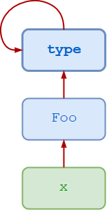
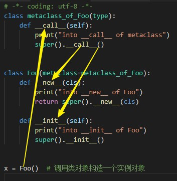

# Metaclasses

[TOC]

> 本文的目标是讨论如何使用自定义元类。由于自定义元类总继承自 `type`，且 `type` 只能构造新式类，所以自定元类也只能构造新式类。因此，本文仅针对新式类展开，不涉及旧式类。强调一点，本文中提到的"类"均指"新式类"。如果想了解新式类和旧式类的差异，可阅读笔记 [Old-Style vs. New-Style Classes](Old-Style vs. New-Style Classes.md) 
>
> 由于 Python 2 中同时存在新式类和旧式类，容易造成混淆。所以文本基于 Python 3 展开。

元编程(*metaprogramming*)是一种编程技术，采用元编程的计算机程序，能够将程序视为数据。这意味着利用元编程技术可以设计出一种能够读取、生成、分析或改变其它程序的程序，利用元编程技术甚至可以在运行时对自身进行修改。

Python 支持一种适用于类的元编程形式，即元类(*metaclasses*)。

## 1. 类的类型

在 Python 3 中，所有自定义类和内置类型([Built-in Types](https://docs.python.org/3.7/library/stdtypes.html#built-in-types))均是新式类。由于新式类将 "类(*class*)" 和 "类型(*type*)" 的概念进行了统一，所以在 Python 3 中 "类(*class*)" 和 "类型(*type*)" 是同义词，两者并没有任何区别。但我们通常会将术语 "类型(*type*)" 用于内置类型(如 `str` 类型)和元类(如 `type` 类型)；将术语 "类(*class*)" 用于自定义类。

由于[在 Python 中一切皆是对象](https://mail.python.org/pipermail/python-list/2015-June/691689.html)，并且所有对象均是"一类(first class)"对象。
因此，类在Python 中也是对象，并且可以对类执行如下操作：

- 把类赋值给一个变量
- 把类作为函数实参进行传递
- 把类作为函数的返回值
- 在运行时动态地创建类

**所有对象皆有类型**，类由元类构造，所以类的类型便是构造它的元类。
例如：在没有使用自定义元类的默认情况下，类由元类 `type` 构造，所以类的类型是元类 `type`。

```python
>>> # in Python3
>>> class Foo:
...     pass
...
>>> x = Foo()

>>> type(x) # 实例对象x的类型是类Foo
<class '__main__.Foo'>

>>> type(Foo) # 类Foo的类型是元类type
<class 'type'>
```

内置类型(*Built-in Types*)同样由元类 `type` 构造，所以内置类型的类型也是 `type`。

```python
>>> for t in int, float, dict, list, tuple:
...     print(type(t))
...
<class 'type'>
<class 'type'>
<class 'type'>
<class 'type'>
<class 'type'>
```

元类 `type` 的类型也是 `type`：

```python
>>> type(type)
<class 'type'>
```

综上可见，在没有使用自定义元类的默认情况下，类对象由元类 `type` 构造，每个类对象均是元类 `type` 的一个实例，元类 `type` 是类对象的类型(元类 `type` 的类型也是 `type`)

因此，对于之前创建的 `Foo` 类，便存在如下链式关系：

- `x` 是类 `Foo` 的一个实例
- 类 `Foo` 是元类 `type` 的一个实例
- 元类 `type` 是其自身的一个实例




对上述链式关系做进一步的抽象，如下：


## 2. 动态创建类对象

在动态语言中类和函数是在运行时动态创建的；而在静态语言中它们在编译时被创建。

Python 作为动态语言，其"类对象"是在运行时由元类动态创建的：当解释器遇到[**类定义语句**](https://docs.python.org/3.7/reference/compound_stmts.html#class-definitions)时，会从中获取三个参数：类名、父类元组、包含类成员的字典；并**调用指定的元类**来处理这三个参数，从而构造出一个类对象。

如果没有指定的元类，则默认调用元类 `type` 来处理参数，并构造类对象。下面我们就来仔细探究元类 `type` 的调用方式。

tips: <u>使用"类定义语句"创建类的方式</u>与<u>使用对应元类创建类的方式</u>完全等效。

### 2.1 type

内置函数 `type()` 其实是元类 `type` 的构造函数，有如下两种使用方式：

- type(*object*) -> the object's type：

  对于新式类，type(*object*) 的返回值通常与 [`object.__class__`](https://docs.python.org/3.7/library/stdtypes.html#instance.__class__) 相同。

  ```python
  >>> # in Python 3
  >>> type(3)
  <class 'int'>
  
  >>> type(['foo', 'bar', 'baz'])
  <class 'list'>
  
  >>> t = (1, 2, 3, 4, 5)
  >>> type(t)
  <class 'tuple'>
  
  >>> class Foo:
  ...     pass
  ...
  >>> type(Foo())
  <class '__main__.Foo'>
  ```

- type(*name*, *bases*, *dict*) -> a new type(or class) object：

  - *name* : a string specifies a name of  new type(or class) object. This becomes the `__name__` attribute of the type(or class).
  - *bases* : a tuple itemizes the base classes. This becomes the `__bases__` attribute of the type(or class).
  - *dict* : a dictionary is the namespace containing definitions for class body . This becomes the `__dict__` attribute of the type(or class).

tips: type(*name*, *bases*, *dict*) 是[**类定义语句**](https://docs.python.org/3.7/reference/compound_stmts.html#class-definitions)的动态形式。在保证参数一直的前提下，通过这两种方式构造出的类对象完全等效。

#### 示例: 最简单的情况

In this first example, the *bases*  and *dict* arguments passed to `type()` are both empty. No inheritance from any parent class is specified, and nothing is initially placed in the namespace dictionary. 

```python
>>> Foo = type('Foo', (), {})

>>> x = Foo()
>>> x
<__main__.Foo object at 0x04CFAD50>
>>> Foo.__bases__ # 基类列表为空，默认继承object
(<class 'object'>,)
```

`Foo` 类也可通过类定义语句构造，如下：(两种构造方式等效)

```python
>>> class Foo:
...     pass
...
>>> x = Foo()
>>> x
<__main__.Foo object at 0x0370AD50>
```

#### 示例: 有基类和字段的情况

*bases*  is a tuple with a single element `Foo`, specifying the parent class that `Bar` inherits from. An attribute, `attr`, is initially placed into the namespace dictionary:

```python
>>> Bar = type('Bar', (Foo,), dict(attr=100))

>>> x = Bar()
>>> x.attr
100
>>> x.__class__
<class '__main__.Bar'>
>>> x.__class__.__bases__
(<class '__main__.Foo'>,)
```

`Bar` 类也可通过类定义语句构造，如下：(两种构造方式等效)

```python
>>> class Bar(Foo):
...     attr = 100
...

>>> x = Bar()
>>> x.attr
100
>>> x.__class__
<class '__main__.Bar'>
>>> x.__class__.__bases__
(<class '__main__.Foo'>,)
```

#### 示例: 有字段和方法的情况

This time, *bases* is again empty. Two objects are placed into the namespace dictionary via the *dict*  argument. The first is an attribute named `attr` and the second a function named `attr_val`, which becomes a method of the defined class:

```python
>>> Foo = type(
...     'Foo',
...     (),
...     {
...         'attr': 100,
...         'attr_val': lambda x : x.attr # x相当于self
...     }
... )

>>> x = Foo()
>>> x.attr
100
>>> x.attr_val()
100
```

`Foo` 类也可通过类定义语句构造，如下：(两种构造方式等效)

```python
>>> class Foo:
...     attr = 100
...     def attr_val(self):
...         return self.attr
...

>>> x = Foo()
>>> x.attr
100
>>> x.attr_val()
100
```

#### 示例: 有字段和外置方法的情况

Only very simple functions can be defined with [`lambda` in Python](https://dbader.org/blog/python-lambda-functions). In the following example, a slightly more complex function is defined externally then assigned to `attr_val` in the namespace dictionary via the name `f`:

```python
>>> def f(obj): # obj相当于self
...     print('attr =', obj.attr)
...
>>> Foo = type(
...     'Foo',
...     (),
...     {
...         'attr': 100,
...         'attr_val': f
...     }
... )

>>> x = Foo()
>>> x.attr
100
>>> x.attr_val()
attr = 100
```

`Foo` 类也可通过类定义语句构造，如下：(两种构造方式等效)

```python
>>> def f(obj):
...     print('attr =', obj.attr)
...
>>> class Foo:
...     attr = 100
...     attr_val = f
...

>>> x = Foo()
>>> x.attr
100
>>> x.attr_val()
attr = 100
```

## 3. 自定义元类

Custom Metaclasses

[3.3.3.1. Metaclasses - Python 3](https://docs.python.org/3.7/reference/datamodel.html#metaclasses)

[3.4.3. Customizing class creation - Python 2](https://docs.python.org/2/reference/datamodel.html#customizing-class-creation)

在前面的两个小节中，我们已经逐步熟悉了元类。
让我们再次回忆一下实例对象、类对象和元类间的关系：


Python 作为动态语言，其"类对象"是在运行时由元类动态创建的：当解释器遇到[**类定义语句**](https://docs.python.org/3.7/reference/compound_stmts.html#class-definitions)时，会从中获取三个参数：类名、父类元组、包含类成员的字典；并**调用指定的元类**来处理这三个参数，从而构造出一个类对象。如果没有指定的元类，则**默认调用**元类 `type` 来处理参数，并构造类对象。

简而言之，元类就是用于构造类对象的类，也被称为类工厂([class factories](https://en.wikipedia.org/wiki/Factory_(object-oriented_programming)))，最常见的元类便是 `type`。如果我们想创建自定义元类，只需继承 `type` 即可。创建自定义元类的主要目的就是为了在构造类对象时，能够自动改变类对象的行为和状态。
Tips: 由于 `type` 只能创建新式类，所以自定义元类也只能创建新式类。

让我们来创建一个简单的自定义元类：

```python
# -*- coding: utf-8 -*-
class Meta(type):  # 自定义元类需继承自type
    def __new__(cls, name, bases, dct):  # __new__方法的参数需和type一致
        # 需通过super调用父类的__new__方法来构造新的类对象
        x = super().__new__(cls, name, bases, dct) 
        x.attr_of_new = 100 # 在元类中为类对象添加自定义属性
        return x # 最后需返回类对象
    def __init__(self, name, bases, dct):
        self.attr_of_init = 200
        super().__init__(name, bases, dict)
```

让我们利用 `Meta` 元类构造来构造新的类对象：

```python
>>> class Foo(metaclass=Meta): # 需使用metaclass关键字指定目标元类
...     pass
...
>>> Foo.attr_of_new # Meta元类为Foo添加了属性
100
>>> Foo.attr_of_init 
200
```


### metaclass 参数

在构造类对象时，如果需要使用特定元类，可使用关键字参数 `metaclass` 引入该元类。如果父类已中引入了某个元类，在构造子类时也会使用该元类。

```python
class Meta(type):
    pass

class MyClass(metaclass=Meta): # MyClass由Meta构造
    pass

class MySubclass(MyClass): # MySubclass同样由Meta构造
    pass
```

Note: Python 2 需使用特殊变量 `__metaclass__`，但 Python 3 不支持该变量。

其实 `metaclass` 参数可以是任意可调用对象，比如：

```python
def func(name, bases, dct): # 可调用对象必须接受这三个参数
    return None # 返回任意对象即可，甚至是None
class Foo(metaclass=func):
    pass
print(Foo) # Out: None
```

一个更复杂的示例，假设我们需要在构造类的过程中，将类对象的所有属性名改为大写：

```python
# the metaclass will automatically get passed the same argument
# that you usually pass to `type`
def upper_attr(future_class_name, future_class_parents, future_class_attr):
    """
      Return a class object, with the list of its attribute turned
      into uppercase.
    """

    # pick up any attribute that doesn't start with '__' and uppercase it
    uppercase_attr = {}
    for name, val in future_class_attr.items():
        if not name.startswith('__'):
            uppercase_attr[name.upper()] = val
        else:
            uppercase_attr[name] = val

    # let `type` do the class creation
    return type(future_class_name, future_class_parents, uppercase_attr)

class Foo(mateclass = upper_attr): 
    bar = 'bip'

print(hasattr(Foo, 'bar'))
# Out: False
print(hasattr(Foo, 'BAR'))
# Out: True

f = Foo()
print(f.BAR)
# Out: 'bip'
```

相同的目标，用自定义元类在做一次：

```python
# remember that `type` is actually a class like `str` and `int`
# so you can inherit from it
class UpperAttrMetaclass(type):
    # __new__ is the method called before __init__
    # it's the method that creates the object and returns it
    # while __init__ just initializes the object passed as parameter
    # you rarely use __new__, except when you want to control how the object
    # is created.
    # here the created object is the class, and we want to customize it
    # so we override __new__
    # you can do some stuff in __init__ too if you wish
    # some advanced use involves overriding __call__ as well, but we won't
    # see this
    def __new__(cls, clsname, bases, dct):

        uppercase_attr = {}
        for name, val in dct.items():
            if not name.startswith('__'):
                uppercase_attr[name.upper()] = val
            else:
                uppercase_attr[name] = val

        return super().__new__(cls, clsname, bases, uppercase_attr)
```

虽然 `metaclass` 可以是任意可调用对象，但建议始终使用元类。

### \_\_new\_\_

如果需要干涉类对象的创建过程，应覆写 `__new__` 。

### \_\_init\_\_

如果需要干涉类对象的初始化过程，可覆写 `__new__` 或 `__init__` 。

### \_\_call\_\_

因为类是元类的实例，所以当我们调用某个类对象时，其实是在调用元类的`__call__` 方法。因此，我们可以借助元类的 `__call__` 方法来修改类对象的行为和状态。

考虑下面这段代码：

```python
# -*- coding: utf-8 -*-
class metaclass_of_Foo(type):
    def __call__(self):
        print("into __call__ of metaclass")
        super().__call__()


class Foo(metaclass=metaclass_of_Foo):
    def __new__(cls):
        print("into __new__ of Foo")
        return super().__new__(cls)

    def __init__(self):
        print("into __init__ of Foo")
        super().__init__()


x = Foo()  # 调用类对象来构造一个实例对象
```

表达式 `x = Foo()` 会为 `Foo` 类构造一个新实例 `x`。
从细节上来说，当解释器遇到 `Foo()` 时，会执行如下操作：

- 首先，因为 `Foo` 是元类 `metaclass_of_Foo` 的实例，所以会调用 `metaclass_of_Foo.__call__(Foo)`；
- 然后，在 `metaclass_of_Foo.__call__(Foo)` 方法中，又会依次调用：
  - `Foo.__new__(Foo)` 
  - `Foo.__init__(x)`

大致过程如下图所示：



#### 单例模式

```python
# -*- coding: utf-8 -*-
class Singleton(type):
    def __new__(cls, name, bases, attrs):
        obj_of_class = super().__new__(cls, name, bases, attrs)
        obj_of_class._instance = None
        return obj_of_class

    def __call__(self, *args, **kwargs):
        if not self._instance:
            self._instance = super().__call__(*args, **kwargs)
        return self._instance


class Cls(metaclass=Singleton):
    pass


one = Cls()
two = Cls()
assert one is two # 无异常
```


### 替代方案

在 Python 中，元类是较为复杂的概念，使用起来也比较容易出错。因此，当我们需要改变类对象的行为和状态时，应尽量考虑更加简洁的方案。比如继承、装饰器和 Monkey Patch。

#### 继承

```python
>>> # 在父类中添加attr属性后，所有子类的均包含attr属性
>>> class Base:
...     attr = 100
...
>>> class X(Base):
...     pass
...
>>> class Y(Base):
...     pass
...
>>> X.attr
100
>>> Y.attr
100
```

#### 装饰器

```python
>>> # 通过装饰器为类对象添加attr属性
>>> def decorator(cls):
...     class NewClass(cls):
...         attr = 100
...     return NewClass
...
>>> @decorator
... class X: # 
...     pass
...
>>> @decorator
... class Y:
...     pass
...

>>> X.attr
100
>>> Y.attr
100
>>> Z.attr
100
```

#### Monkey Patch

```python
class Foo(object):
    def bar(self):
        print('Foo.bar')

def bar(self):
    print('Modified bar')

Foo().bar() # Monkey Patch 
Foo.bar = bar
Foo().bar() # Out: Modified bar
```

### 示例: ORM

元类的主要用途是创建API。一个典型的例子是Django ORM。它允许你像这样定义：

```python
class Person(models.Model):
    name = models.CharField(max_length=30)
    age = models.IntegerField()
```

但是如果你像这样做的话：

```python
guy = Person(name='bob', age='35')
print(guy.age)
```

这并不会返回一个IntegerField对象，而是会返回一个int，甚至可以直接从数据库中取出数据。这是有可能的，因为models.Model定义了__metaclass__， 并且使用了一些魔法能够将你刚刚定义的简单的Person类转变成对数据库的一个复杂hook。Django框架将这些看起来很复杂的东西通过暴露出一个简单的使用元类的API将其化简，通过这个API重新创建代码，在背后完成真正的工作。

ORM (Object Relational Mappers for working with databases)

## 术语

以下内容来自官方的术语表。

### object

Any data with state (attributes or value) and defined behavior (methods). Also the ultimate base class of any [new-style class](https://docs.python.org/3.7/glossary.html#term-new-style-class).

### class

A template for creating user-defined objects. Class definitions normally contain method definitions which operate on instances of the class.

### type

The type of a Python object determines what kind of object it is; every object has a type. An object’s type is accessible as its [`__class__`](https://docs.python.org/3.7/library/stdtypes.html#instance.__class__) attribute or can be retrieved with`type(obj)`.

### metaclass

The class of a class. Class definitions create a class name, a class dictionary, and a list of base classes. The metaclass is responsible for taking those three arguments and creating the class. Most object oriented programming languages provide a default implementation. What makes Python special is that it is possible to create custom metaclasses. Most users never need this tool, but when the need arises, metaclasses can provide powerful, elegant solutions. They have been used for logging attribute access, adding thread-safety, tracking object creation, implementing singletons, and many other tasks.

More information can be found in [Metaclasses](https://docs.python.org/3.7/reference/datamodel.html#metaclasses) and in  [Customizing class creation](https://docs.python.org/2/reference/datamodel.html#metaclasses).


## 扩展阅读

- [Python基础：元类](http://www.cnblogs.com/russellluo/p/3409602.html)
- [在Python中使用class decorator和metaclass](http://blog.zhangyu.so/python/2016/02/19/class-decorator-and-metaclass-in-python/)
- [Meta-classes Made Easy](http://www.voidspace.org.uk/python/articles/metaclasses.shtml)
- [Metaclass Programming In Python](http://gnosis.cx/publish/programming/metaclass_1.html)

## 参考

- https://en.wikipedia.org/wiki/Metaprogramming

- https://realpython.com/python-metaclasses/

- [Metaclasses in Five Minutes](http://www.voidspace.org.uk/python/articles/five-minutes.shtml)

- [陌生的 metaclass](https://funhacks.net/explore-python/Class/metaclass.html)

- [使用元类 - 廖雪峰](https://www.liaoxuefeng.com/wiki/0014316089557264a6b348958f449949df42a6d3a2e542c000/0014319106919344c4ef8b1e04c48778bb45796e0335839000#0)

- [3.3.3. Customizing class creation - Python 3](https://docs.python.org/3.7/reference/datamodel.html#customizing-class-creation)

- [3.4.3. Customizing class creation - Python 2](https://docs.python.org/2/reference/datamodel.html#customizing-class-creation)

- [oop - What is a metaclass in Python? - Stack Overflow](http://stackoverflow.com/questions/100003/what-is-a-metaclass-in-python)

  - 译文：[深刻理解Python中的元类(metaclass) - 伯乐在线](http://blog.jobbole.com/21351/)

- 