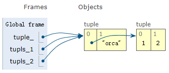

# tuple

```
class tuple(object)
 |  tuple() -> empty tuple
 |  tuple(iterable) -> tuple initialized from iterable's items
 |  
 |  If the argument is a tuple, the return value is the same object.
```

🔨 *class* `tuple`([*iterable*])

该内置函数本质上是 [`tuple`](https://docs.python.org/3.7/library/stdtypes.html#tuple) 类的构造函数，用于创建 [`tuple`](https://docs.python.org/3.7/library/stdtypes.html#tuple) 实例。

如果没有向 tuple 函数传递任何参数，则会创建一个空元组：

```python
>>> tuple()
()
```

如果向 tuple 函数传递一个可迭代对象，则会以 *iterable* 中的元素来构建一个新序列。新建元组对象中各个项的值和顺序均与 *iterable* 中各个项的值和顺序相同。*iterable* 可以是序列，也可是支持迭代的容器，还可以是迭代器对象。

```python
>>> tuple('abc')
('a', 'b', 'c')
>>> tuple( [1, 2, 3] )
(1, 2, 3)
>>> tuple(range(1,5))
(1, 2, 3, 4)
```

如果 *iterable* 本身就是一个元组，则会直接返回该元组对象，与 `iterable[:]` 等效：

```python
tuple_ = ((1,2),'orca')
tupls_1 = tuple(tuple_)
tupls_2 = tuple_[:]
```

执行结果：



扩展阅读：

- 笔记『序列类型(list,tuple,range).md』
- [Tuples](https://docs.python.org/3.7/library/stdtypes.html#typesseq-tuple)
- [Sequence Types — list, tuple, range](https://docs.python.org/3.7/library/stdtypes.html#typesseq)