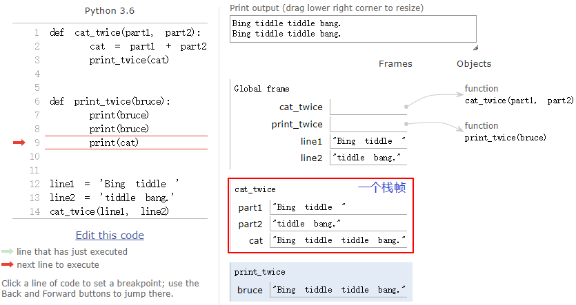

# 调用栈

栈是一种 LIFO 形式的**数据结构**，是由高地址向低地址生长的一块连续的内存区域，栈顶地址和栈的最大容量都是系统预先规定好的。栈支持两种基本操作，push 和 pop。push 将数据压入栈中，pop 将栈中的数据弹出并存储到指定寄存器或者内存中。

函数调用过程由**调用栈**(call stack)实现。解释器使用调用栈传递函数参数、保存返回地址、存储局部变量，以及临时保存寄存器原有值(即函数调用的上下文)以备恢复。

调用栈由栈帧组成，每个运行中的函数都会占用一个独立的连续区域，这便是**栈帧**(*Stack Frame*)。栈帧存放着函数参数、局部变量及恢复前一栈帧所需要的数据等。栈帧是调用栈的逻辑片段，当调用函数时逻辑栈帧被压入栈，当函数返回时逻辑栈帧被从栈中弹出。由于函数调用经常是嵌套的，在同一时刻，堆栈中会有多个函数的信息。所以，整个栈空间中可能会同时存在多个栈帧。

通过绘制**栈图**(*stack diagram*)，可以帮助我们分析函数的执行状态，以便了解参数值、局部变量等信息。栈图中的每一层表示一个栈帧，每个栈帧表示一个运行中的函数，其中包含了对应的形参和局部变量。栈帧按照嵌套调用的顺序从上至下排列，比如下图中，在 `cat_twice` 内部嵌套调用了 `print_twice`，因此 `print_twice` 位于 `cat_twice` 下方。



如果在函数调用过程中发生了错误，Python 会从出错的函数开始持续追溯外层函数，直到 `<module>` 为止，并按照调用栈中的顺序依次打印出每一层栈帧。因此，造成错误的栈帧总位于**回溯**(*traceback*)列表的最底部。回溯列表向我们展示了造成异常的详细信息，其中包括文件名、行号、函数名和产生异常的代码，并给出提示信息。

另外，`<module>` 是表示最上层栈帧的特殊名字，在模块的最外层声明的所有变量均属于 `<module>` 栈帧。

```python
def cat_twice(part1, part2):
    cat = part1 + part2
    print_twice(cat)


def print_twice(bruce):
    print(bruce)
    print(bruce)
    print(cat)


line1 = 'Bing tiddle '
line2 = 'tiddle bang.'
cat_twice(line1, line2)
"""Out:
Bing tiddle tiddle bang.
Bing tiddle tiddle bang.
Traceback (most recent call last):
  File "c:/Users/iwhal/Desktop/内置函数/test.py", line 14, in <module>
    cat_twice(line1, line2)
  File "c:/Users/iwhal/Desktop/内置函数/test.py", line 3, in cat_twice
    print_twice(cat)
  File "c:/Users/iwhal/Desktop/内置函数/test.py", line 9, in print_twice
    print(cat)
NameError: name 'cat' is not defined
"""
```

