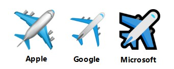
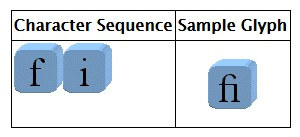
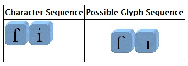

# 抽象字符库

Abstract Character Repertoire (ACR)

[TOC]

Tips：在 Unicode 文档的大多数语境中，将抽象字符库与字符库(*character repertoire*)视为同义词，本文也如此。

字符库是包含抽象字符的**无序集合**，字符库有封闭(*fixed* )和开放(*open*)之分：

- 封闭字符库一旦确定，就再也不会改变，如 ASCII。如果想要在封闭字符库中添加新的抽象字符，就需要另建一个新标准，不能在原有标准中直接添加。
- Unicode 标准是典型的开放字符库，允许向其中添加新的抽象字符。

由于字符库存是包含抽象字符的无序集合，所以我们可以把它想象为一个集合类型，这里以 Python 的集合类型为例：

```python
Character_Repertoire = {"6", "$", "ü", "L", "鲸", "あ", "Д", "α", "å", "😯", ...}
```

## 1. 字符 vs. 字形

> 为了避免歧义，我们需要先明确术语的定义：(参考 Unicode 术语表)
>
> - ***字符*** (Character) (1)在书面语言中具备语义价值的最小组成部分，泛指抽象的意义和[或]形状(*shape*)，而非特定的形状 (see also *glyph*)；然而在编码表(*code tables*)中，为了便于读者理解，呈现某种形式的视觉表示是必不可少的。(2)抽象字符的同义词。
> - ***抽象字符*** (Abstract Character)：用于组织、控制或表示文本数据的信息单元。
>   - 抽象字符没有具体形式，不应与字形(*glyph*)混淆
>   - 抽象字符不一定与用户认为的“字符”相对应，不应与字素( *grapheme* )混淆。例如，可能只是字素的一部分，比如一个汉字的部首。
>
> 依据"字符"的第一种定义，我们应将"字符"视作"抽象字符"的一个子集。因为，它只包含了书面语言中具备语义价值的部分(即，用于表示文本数据的信息单元)，但并不包含用于组织和控制文本数据的信息单元。但在 Unicode 术语表中，很多时候会将"字符"与"抽象字符"视作同义词，也就是采用字符的第二种定义。在本文中也会**将"字符"与"抽象字符"视作同义词**。

### 1.1 如何理解字符和字形

单从定义上来看，我们很难对"抽象字符"的概念有一个清晰的认识，那么到底什么是"抽象字符"喃？
在阅读文字时，我们通过视觉观察到的其实是字形(*glyph*)——字形是表示某个字符的特定图像，有时也可能只是表示某个字符的某一部分的特定图像。我们可以将"抽象字符"想象为"字形"的父类，虽然两者间的关系并非如此，但足够清晰。抽象字符规定了字形的"形式"，但并没有给出具体的实现方式。字形作为抽象字符的子类，对各种抽象"形式"给出了具体实现。由于具体实现方式的差异，抽象字符便会产生不同的子类，从而形成不同的字形。

以 Emoji 中的飞机(Airplane)为例：用于描述飞机的抽象字符给出了飞机的抽象"形式"，如有流线型的机身、有机翼、有引擎等；但抽象字符并没有给出这些"形式"的具体实现方式，比如引擎的数量、飞机的颜色、飞机的比例等。飞机的字形为各种抽象"形式"给出了具体实现，比如给定了引擎的数量；明确了飞机的颜色及比例；是卡通风格还是写实风格等。因此，我们可以通过视觉观察到飞机的字形。由于实现方式的差异，便会在视觉上形成不同的飞机，这些不同的飞机代便是同一个抽象字符的不同字形。



再比如说大写字母 O，其抽象字符给出该字母的"形式"：一个类似于圆的形状；但没有给出具体的实现方式，如圆的大小、长宽比、字重、字宽等。字母 O 的字形为各种抽象"形式"给定了具体实现(比如给定了字重、字宽等)，以便我们可通过视觉观察到字母 O。同样，由于实现方式的差异，我们便会在视觉上观察到不同的字母 O，如下：


注意，抽象字符和字形并非继承关系，上述内容只是为了便于理解，才采用了继承关系。从技术上来说，当需要可视化某个抽象字符时，会在合成(composition)和布局(layout)处理期间，通过渲染引擎来选择相应字形。

补充一点：字体(*Font*)是字形的集合，用于字符数据的可视化描述。字体通常会关联一组参数[例如，size, posture, weight, serifness]，在为参数设置特定值后，便会生成一个图像化(imagable)的字形集合。不过这都属于渲染引擎的工作，这又是另一个复杂的问题了。

### 1.2 字符和字形的对应关系

在显示同一字符时，可选择不同的字形，并且这些字形的形状(shape)可能会有较大的差异。下图展示了小写字母 'a' 的字符和部分字形样式：


Note: 字符 'a' 是为了便于读者理解，而呈现的视觉表示。

字形和字符并非总是一一对应关系：

- 单个字形可能会对应多个字符。例如，由 'f' 和 'i' 构成的字符序列，可以被显示为单个字形。该字形表示所表示的符号被叫做 *fi ligature* 。

  

  Note: 在合并后的形状中，字符 'i' 少了一个点。

- 极端情况下甚至可能存在多对多的情况。比如上列中 *fi ligature* 的字形也可能是由一个字形序列组合而成的。

  

  Note: 在显示某一字符时，是使用单个字形还是使用字形序列，是由字体和渲染软件决定的。

- 单个字符可对应单个字形，也可对应一个字形序列。例如，重音(*accented*)字符可以由单个字形表示，也可以由一个字形序列来表示。另外，我们最终观察到的字形也可能是由一个字符序列组成的，如下图中的第二行。

  

在*non-Latin script* 中，字形和字符之间的对应关系甚至会让人觉得意外。因为，在绘制字形的具体形状时，还需要考虑其周围的字形，这种字形被称作 *contextual forms* 。例如，阿拉伯字符 *heh* 就具有四中上下文字形。


另外，字形的排序也不一定对应于字符的排序，特别是阿拉伯语和希伯来语等从右到左的 *script* 中，会存在复杂的重排序过程。特定字符序列能否显示为特定字符串，取决于操作系统和字体的复杂程度。

### 1.3 其它术语

以下内容直接翻译自 Unicode 术语表：

> - ***抽象字符序列*** (Abstract Character Sequence)：一个或多个抽象字符的有序序列(See definition D8 in Section [Section 3.4, Characters and Encoding](http://www.unicode.org/versions/latest/ch03.pdf#G2212).) 
> - ***字形*** (glyph)：(1)表示一个或多个"字形图形"的抽象形式。(2)与字形图像(glyph image)同义。在显示 Unicode 字符数据时，可以选择一个至多个字形来描绘特定字符。在合成(composition )和布局(layout)处理期间，会通过渲染引擎选择这些字形。(See also *character*.)
> - ***字形图像*** (Glyph Image)：已经点阵化(rasterized)或以其它方式成像到某些显示表面的字形表示的具体图像。The actual, concrete image of a glyph representation having been rasterized or otherwise imaged onto some display surface.
> - ***字体*** (Font)：字形的集合，用于字符数据的可视化描述。字体通常会关联一组参数[例如，size, posture, weight, serifness]，在为参数设置特定值后，便会生成一个图像化(*imagable*)的字形集合。
> - ***渲染*** (Rendering). (1) 为了描绘字符，而选择并布局字形的过程。(2) 在显示设备上显示字形的过程。
