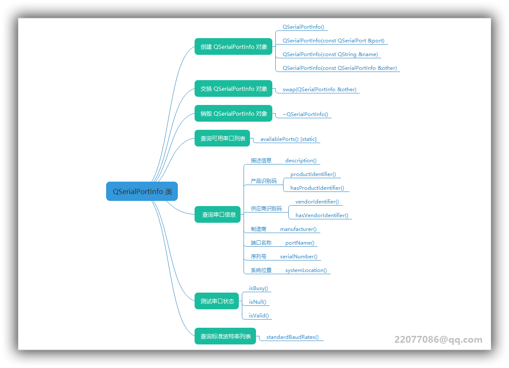

# Qt SerialPort 与 PyQt5 (一)

[TOC]

> 本文会先介绍 Qt 自带的串口模块，然后引出在 PyQt5 中使用这些模块的方法。
> 为了演示类和函数的具体使用方法，我会在串口上连接一台 Arduino Uno。当然也可以使用虚拟串口程序进行演示，但是被虚拟出来的串口总会缺少一些信息，所以我还是采用了外接 Arduino 的方法。
> 系统环境：Win10 64位
> 转载请注明出处：[http://www.jianshu.com/u/5e6f798c903a](https://www.jianshu.com/u/5e6f798c903a)

## 1.简介

Qt 串口模块提供的基本功能包括：串口配置、I/O 操作、获取和设置 RS-232 引脚的控制信号等。该模块的 [C++ 类](https://doc.qt.io/qt-5/qtserialport-module.html) 包含 [QSerialPort](https://doc.qt.io/qt-5/qserialport.html)（用于提供访问串行端口的函数）和 [QSerialPortInfo](https://doc.qt.io/qt-5/qserialportinfo.html)（提供本机现存串行端口的相关信息），官方同时也提供了一些[应用程序示例](https://doc.qt.io/qt-5/qtserialport-examples.html) 。

本模块不支持以下项目：

- 终端功能，如 echo 和 CR/LF 控制等
- 文本模式
- 在对串口进行读取或写入时，配置超时和延迟
- 引脚信号变化通知

在 Qt 应用程序中使用串行端口时，请添加 `#include < QSerialPort >` ，
对 PyQt5 而言，则是：`from PyQt5.QtSerialPort import QSerialPort` 。

在 Qt 应用程序中查看本机现存串口信息时，请添加 `#include < QSerialPortInfo >` ，
对 PyQt5 而言，则是：`from PyQt5.QtSerialPort import QSerialPortInfo` 。

与模块连接时，请将 `QT += serialport` 添加到  [qmake](https://doc.qt.io/qt-5/qmake-manual.html) .pro 文件中，PyQt5 中没有类似操作。

## 2.QSerialPortInfo 类

> [官方文档](https://doc.qt.io/qt-5/qserialportinfo.html)
> Header:	\#include \<QSerialPortInfo\>
> qmake:	QT += serialport
> Since:	Qt 5.1

该类用于提供本机现有串口的相关信息。

**静态公共成员：**

- `QList<QSerialPortInfo> availablePorts()`
- `QList<qint32>standardBaudRates()`



### 2.1 创建 QSerialPortInfo 对象

- QSerialPortInfo()
  构造一个空 QSerialPortInfo 对象。如果 QSerialPortInfo 对象为空，则表示不持有串口定义，若对其调用 [isNull](https://doc.qt.io/qt-5/qserialportinfo.html#isNull)() 函数，会返回 `True` 。
- QSerialPortInfo(const QSerialPort *&port*)
  使用指定的 QSerialPort 对象，构建相应的 QSerialPortInfo 对象。
- QSerialPortInfo(const QString &*name*)
  根据给定的串口名 &*name*，构造 QSerialPortInfo 对象。
  该构造器会在本机当前可用的串口中查找具有相应名称的串口，并为该端口构建 QSerialPortInfo 实例。
- QSerialPortInfo(const QSerialPortInfo &*other*)
  创建另一个 QSerialPortInfo 对象的副本。


在 PyQt5 调用上述语句便可创建相应实例。

**Tips**：[QSerialPortInfo](https://doc.qt.io/qt-5/qserialportinfo.html) 实例对象可用作  [QSerialPort](https://doc.qt.io/qt-5/qserialport.html) 类中 setPort() 方法的输入参数，以此创建 [QSerialPort](https://doc.qt.io/qt-5/qserialport.html) 的实例。

```
class QSerialPortInfo(): # skipped bases: <class 'sip.simplewrapper'>
    """
    QSerialPortInfo()
    QSerialPortInfo(QSerialPort)
    QSerialPortInfo(str)
    QSerialPortInfo(QSerialPortInfo)
    """
```

### 2.2 交换 QSerialPortInfo 对象

- void QSerialPortInfo::swap([QSerialPortInfo](https://doc.qt.io/qt-5/qserialportinfo.html#QSerialPortInfo) &*other*)
  如果存在两个分别指向不同的 QSerialPortInfo 实例的变量名，对其中一个实例调用 `swap()` 方法，并将另一作为参数，便可将两个变量名所指向的实例对象进行互换。此操作会非常迅速的执行，并且永远不会失败。

示例代码：

```
from PyQt5.QtSerialPort import QSerialPortInfo

port_Arduino = QSerialPortInfo('COM4')
port_virtual = QSerialPortInfo('COM1')
print(port_Arduino.portName())
print(port_virtual.portName())

port_Arduino.swap(port_virtual)
print(port_Arduino.portName())
print(port_virtual.portName())
```

输出：

```
COM4
COM1
COM1
COM4
```

### 2.3 销毁 QSerialPortInfo 对象

- ~QSerialPortInfo()
  销毁 QSerialPortInfo 对象。当对象被销毁后，便无法再引用该对象的值。


PyQt5 中没有此函数，可使用 `del` 替代。

### 2.4 查询可用串口列表

- QList\<QSerialPortInfo\>  QSerialPortInfo::availablePorts() [static]

静态函数 `availablePorts()` 可生成由 [QSerialPortInfo](https://doc.qt.io/qt-5/qserialportinfo.html) 对象组成的列表。列表中的每个 [QSerialPortInfo](https://doc.qt.io/qt-5/qserialportinfo.html) 对象都表示一个独立的串行端口，并且可以通过这些 [QSerialPortInfo](https://doc.qt.io/qt-5/qserialportinfo.html) 对象查询相应端口的名称、系统位置、描述信息及制造商等信息。

示例代码：

```
# python 代码：
from PyQt5.QtSerialPort import QSerialPortInfo

port_list = QSerialPortInfo.availablePorts()
print(port_list[0].portName())
print(port_list[0].description())

```

输出：

```
COM4
Genuino Uno
```

### 2.5 查询串口信息

#### 描述信息

- QString QSerialPortInfo::description() const
  如果存在用于描述串口相关信息的字符串，则返回该字符串。否则，返回空字符串。

示例代码：

```python
# python 代码：
from PyQt5.QtSerialPort import QSerialPortInfo

port_Arduino = QSerialPortInfo('COM3')
print(port_Arduino.description())
```

输出：

```
Genuino Uno
```

#### 产品识别码

- [quint16](https://doc.qt.io/qt-5/qtglobal.html#quint16-typedef) QSerialPortInfo::productIdentifier() const
  如果被查询的 QSerialPortInfo 串口实例存在 `16-bit` 产品编码，则返回该编码；否则，返回 0。


- bool QSerialPortInfo::hasProductIdentifier() const
  如果被查询的 QSerialPortInfo 串口实例存在有效的 `16-bit` 产品编码，便会返回 `true` ；否则，返回 `false` 。

示例代码：

```
# python 代码：
port_Arduino = QSerialPortInfo('COM3')
print(port_Arduino.hasProductIdentifier())
print(port_Arduino.productIdentifier())
```

输出：

```
True
579
```

#### 供应商识别码

- [quint16](https://doc.qt.io/qt-5/qtglobal.html#quint16-typedef) QSerialPortInfo::vendorIdentifier() const
  如果被查询的 QSerialPortInfo 串口实例存在 `16-bit` 的供应商识别码，则返回该编码；否则，返回 0。
- bool QSerialPortInfo::hasVendorIdentifier() const
  如果被查询的 QSerialPortInfo 串口实例存在有效的 `16-bit` 供应商编码，则返回 `true` ；否则，返回 `false` 。

示例代码：

```
# python 代码：
port_Arduino = QSerialPortInfo('COM4')
print(port_Arduino.hasVendorIdentifier())
print(port_Arduino.vendorIdentifier())
```

输出：

```
True
9025
```

#### 制造商

- [QString](https://doc.qt.io/qt-5/qstring.html) QSerialPortInfo::manufacturer() const
  如果被查询的 QSerialPortInfo 串口实例含有制造商字符串，则返回该字符串；否则，返回一个空字符串。

示例代码：

```
# python 代码：
port_Arduino = QSerialPortInfo('COM4')
print(port_Arduino.manufacturer())
```

输出：

```
Arduino LLC (www.arduino.cc)
```

#### 端口名称

- [QString](https://doc.qt.io/qt-5/qstring.html) QSerialPortInfo::portName() const
  返回被查询的 QSerialPortInfo 串口实例的名称。

示例代码：

```
# python 代码：
port_Arduino = QSerialPortInfo('COM4')
print(port_Arduino.portName())
```

输出：

```
COM4
```

#### 序列号

- [QString](https://doc.qt.io/qt-5/qstring.html) QSerialPortInfo::serialNumber() const
  如果被查询的 QSerialPortInfo 串口实例存在序列号字符串，则返回该字符串；否则，返回一个空字符串。
  注意：序列号可能会包含字母，该函数在 Qt 5.3 被引入。

示例代码：

```
# python 代码：
port_Arduino = QSerialPortInfo('COM4')
print(port_Arduino.serialNumber())
```

输出：

```
55438303539351200210
```

#### 系统位置

- [QString](https://doc.qt.io/qt-5/qstring.html) QSerialPortInfo::systemLocation() const
  返回被查询的 QSerialPortInfo 串口实例的系统位置。

示例代码：

```
# python 代码：
port_Arduino = QSerialPortInfo('COM4')
print(port_Arduino.systemLocation())
```

输出：

```
\\.\COM4
```

### 2.6 测试串口状态

- bool QSerialPortInfo::isBusy() const
  如果被查询的 QSerialPortInfo 串口实例忙，则返回 `true` ；否则，返回 `false` 。
- bool QSerialPortInfo::isNull() const
  如果被查询的 QSerialPortInfo 串口实例持有串口定义，则返回 `false` ；否则。返回 `true` 。
- bool QSerialPortInfo::isValid() const
  如果被查询的 QSerialPortInfo 串口实例存在于本机上，则返回 `true` 。否则返回 `false` 。注意，该函数已经被废弃！！！

示例代码：

```
# python 代码：
port_Arduino = QSerialPortInfo('COM4')
print(port_Arduino.isBusy())
print(port_Arduino.isNull())
print(port_Arduino.isValid(),end='\n\n')

port_null = QSerialPortInfo()
print(port_null.isBusy())
print(port_null.isNull())
print(port_null.isValid())
```

输出：

```
False
False
True

False
True
False
```

### 2.7 查询标准波特率列表

- QSerialPortInfo::standardBaudRates()  [static]
  返回在当前系统平台上可用的标准波特率列表。

示例代码：

```
from PyQt5.QtSerialPort import QSerialPortInfo

print(QSerialPortInfo.standardBaudRates())
```

输出：

```
[110, 300, 600, 1200, 2400, 4800, 9600, 14400, 19200, 38400, 56000, 57600, 115200, 128000, 256000]
```

### 2.8 运算符

- [QSerialPortInfo](https://doc.qt.io/qt-5/qserialportinfo.html#QSerialPortInfo) &QSerialPortInfo::operator=(const [QSerialPortInfo](https://doc.qt.io/qt-5/qserialportinfo.html#QSerialPortInfo) &*other*)
  Sets the [QSerialPortInfo](https://doc.qt.io/qt-5/qserialportinfo.html) object to be equal to *other*. 
  注意：是 `=` 等号操作符。


