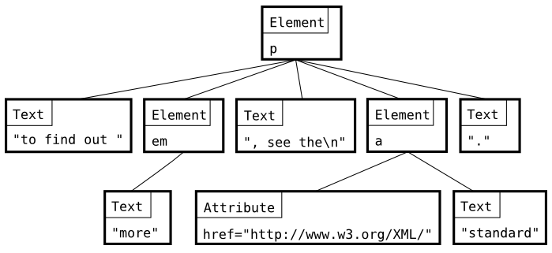
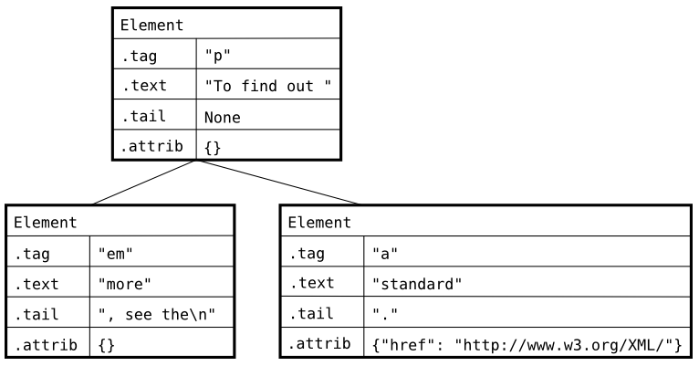

# LXML
> GitHub@[orca-j35](https://github.com/orca-j35)，所有笔记均托管于 [python_notes](https://github.com/orca-j35/python_notes) 仓库
>
> 参考: 
>
> - [`xml.etree.ElementTree`](https://docs.python.org/3/library/xml.etree.elementtree.html#module-xml.etree.ElementTree) — The ElementTree XML API
> - [lxml 学习笔记](https://www.jianshu.com/p/e084c2b2b66d)
> - [Python爬虫利器——lxml 和 xpath 表达式](http://yifei.me/note/464)
>
> 扩展阅读:
>
> - 
> - [Python HTML Parser Performance](http://www.ianbicking.org/blog/2008/03/python-html-parser-performance.html)
> - [HTML DOM 节点](http://www.w3school.com.cn/htmldom/dom_nodes.asp)
> - [How ElementTree represents XML](https://infohost.nmt.edu/tcc/help/pubs/pylxml/web/etree-view.html)

## 概述

> The lxml XML toolkit is a Pythonic binding for the C libraries [libxml2](http://xmlsoft.org/) and [libxslt](http://xmlsoft.org/XSLT/). 
>
> The lxml is the most feature-rich and easy-to-use library for processing XML and HTML in the Python language.

lxml 支持 [XPath and XSLT](https://lxml.de/xpathxslt.html)

相关资源:

- Home: https://lxml.de/
- PyPI: https://pypi.org/project/lxml/
- GitHub: https://github.com/lxml/lxml
- Docs-EN: https://lxml.de/index.html#documentation
- Tutorials:
  - the [lxml.etree tutorial for XML processing](https://lxml.de/tutorial.html)
  - John Shipman's tutorial on [Python XML processing with lxml](http://www.nmt.edu/tcc/help/pubs/pylxml/) 🍰
  - Fredrik Lundh's [tutorial for ElementTree](http://effbot.org/zone/element.htm)
    - [`xml.etree.ElementTree`](http://docs.python.org/library/xml.etree.elementtree.html) is now an official part of the Python library. 

安装:

```shell
conda install lxml
```

Tips: 如果在使用 `pip` 安装时，如果提示缺少依赖库(如 libxml2)，则可采用 wheel 方式安装。在 https://www.lfd.uci.edu/~gohlke/pythonlibs/#lxml 中下载需要的版本(如 Win64、Python3.6 需选择 lxml‑3.8.0‑cp36‑cp36m‑win_amd64.whl)，然后在本地安装 `.whl` 文件即可。

注意，lxml 库不仅包含 `etree` 模块，还包含 `html`、`cssselect` 等模块。另外，我们还可以在 `lxml.html` 的文档中看到 BeautifulSoup 和 html5lib 的身影:

> [BeautifulSoup](http://www.crummy.com/software/BeautifulSoup/) is a Python package for working with real-world and broken HTML, just like [lxml.html](https://lxml.de/lxmlhtml.html). As of version 4.x, it can use [different HTML parsers](http://www.crummy.com/software/BeautifulSoup/bs4/doc/#installing-a-parser), each of which has its advantages and disadvantages (see the link).
>
> lxml can make use of BeautifulSoup as a parser backend, just like BeautifulSoup can employ lxml as a parser. 
>
> lxml interfaces with BeautifulSoup through the `lxml.html.soupparser` module. 
>
> -- 详见 https://lxml.de/elementsoup.html
>
> lxml can benefit from the parsing capabilities of html5lib through the lxml.html.html5parser module. In order to make use of the HTML5 parser of [html5lib](https://pypi.python.org/pypi/html5lib) instead, it is better to go directly through the [html5parser module](https://lxml.de/html5parser.html) in `lxml.html`.
>
> -- 详见 https://lxml.de/html5parser.html

如需了解 lxml 库的层次结构，可参考 https://lxml.de/api/index.html

## XML tree and elements

> 参考:
>
> - https://docs.python.org/3/library/xml.etree.elementtree.html#xml-tree-and-elements
> - [XML DOM 教程](http://www.w3school.com.cn/xmldom/index.asp)
> - [HTML DOM 教程](http://www.w3school.com.cn/htmldom/index.asp)

因为 XML 是一种层次化的数据格式，所以表示 XML 最佳方式是使用树(*tree*)，在 `lxml.etree` 模块中有两个用于此目的类: `ElementTree` 和 `Element`。`ElementTree` 类用于将整个 XML 文档表示为树，`Element` 用于表示树中的单个节点。在与整个文档进行交互(读写文件)时，通常会在 `ElementTree` 级别上完成；在与单个 XML 元素及其子元素交互时，通常会在 `Element` 级别上完成。

`ElementTree` 和 `Element` 的构造函数如下:

- 🔨Element(\_tag, attrib=None, nsmap=None, \*\*\_extra)

  Element factory. This function returns an object implementing the Element interface.

  Also look at the [_Element.makeelement()](https://lxml.de/api/lxml.etree._Element-class.html#makeelement) and `_BaseParser.makeelement()` methods, which provide a faster way to create an Element within a specific document or parser context.

- 🔨ElementTree(*element=None*, file=None, parser=None) 

  ElementTree wrapper class.

`lxml.etree` 表示 XML 文档树的方式与 [DOM](http://www.w3school.com.cn/htmldom/dom_nodes.asp) 稍有不同:

- DOM 树由[节点(*Node*)](http://www.w3school.com.cn/xmldom/dom_nodes.asp)组成，XML 文档中的每个部分都是一个节点:
  - 整个文档是一个文档节点
  - 每个 XML 标签是一个元素节点
  - 包含在 XML 元素中的文本是文本节点
  - 每一个 XML 属性是一个属性节点
  - 注释属于注释节点
- `lxml.etree` 仅使用元素节点来构建树，Element tree 与 DOM tree 的主要区别在于前者将文本与元素关联。`lxml.etree` 模块的 [`Element` 对象](https://lxml.de/api/index.html)包含如下属性:
  - `.tag`
  - ？怎么看到 Element 的方法？

以下面这段 XHTML 为例，来展示 DOM tree 与 Element tree 的不同:

```Xml
<p>To find out
    <em>more</em>, see the
    <a href="http://www.w3.org/XML">standard</a>.
</p>
```

DOM tree 如下:



Element tree 如下:




## lxml.etree

> 参考: https://lxml.de/tutorial.html


## lxml.html

> 参考: https://lxml.de/lxmlhtml.html


> Since version 2.0, lxml comes with a dedicated Python package for dealing with HTML: `lxml.html`. It is based on lxml's HTML parser, but provides a special Element API for HTML elements, as well as a number of utilities for common HTML processing tasks.

