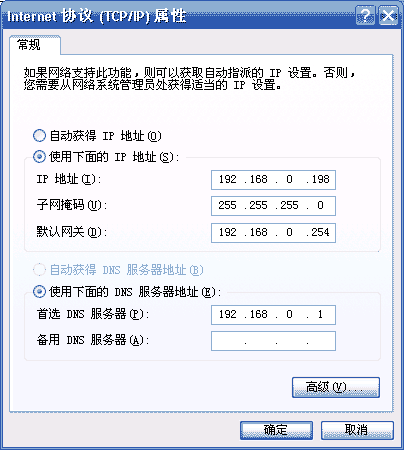
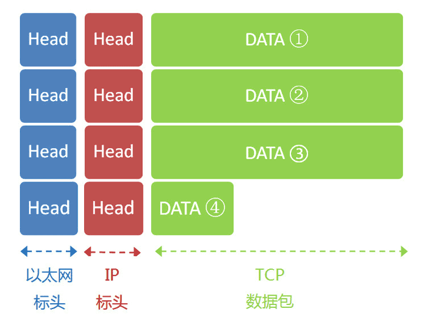

# 互联网协议入门
> GitHub@[orca-j35](https://github.com/orca-j35)，所有笔记均托管于 [python_notes](https://github.com/orca-j35/python_notes) 仓库
>
> 参考:
>
> - [互联网协议入门(一)](http://www.ruanyifeng.com/blog/2012/05/internet_protocol_suite_part_i.html)
> - [互联网协议入门(二) ](http://www.ruanyifeng.com/blog/2012/06/internet_protocol_suite_part_ii.html)

互联网的核心是一系列协议，即"互联网协议族(Internet Protocol Suite)"。协议族对电脑如何连接和组网，做出详细的规定。理解了互联网中的各种协议，才能理解了互联网的原理。

## 五层模型

在实现互联网的过程中，人们将互联网划分为很多层，每一层都有其特定的功能。在构建互联网的分成模型时，有的采用七层模型，有的采用四层模型。这里参考阮一峰老师的教程，采用五层模型，从上至下依次为:

- 应用层(*Application* *Layer*)
- 传输层(*Transport* Layer)
- 网络层(*Network* Layer)
- 连接层(*Link* *Layer*)
- 实体层(*Physical* *Layer*)

越下面的层，越靠近硬件；越上面的层，越靠近用户。

每一层都有都有其特定功能，为了实现这些功能，大家共同遵守的规则便是"协议(*protocol*)"。互联网的每一层都定义了很多协议，这些协议被统称为"互联网协议族(Internet Protocol Suite)"。

## 实体层

实体层(*Physical* *Layer*)也称物理层，描述了硬件的物理连接方法，主要规定了网络的一些电气特性，作用是负责传送电信号，比如高电平表示 1，低电平表示 0。

## 连接层

"连接层"位于"实体层"上方，规定了电信号的排序和分组方式。

要想使实体层中的电信号携带有意义的信息，我们便需要规定电信号的排序方式，这样才能按照特定顺序解读出电信号的含义，这便是"连接层"的功能。

### 以太网协议

[以太网](https://zh.wikipedia.org/wiki/%E4%BB%A5%E5%A4%AA%E7%BD%91)(*Ethernet*)协议是一种典型的连接层协议，该协议将一组由电信号构成的数据包叫做"帧(*Frame*)"，每一帧由标头(*Head*)和数据(*Data*)。


"标头"包含数据包的一些说明项，比如发送者、接受者、数据类型等等；"数据"则是数据包的具体内容。

"标头"的长度，固定为18字节。"数据"的长度，最短为46字节，最长为1500字节。因此，整个"帧"最短为64字节，最长为1518字节。如果数据很长，就必须分割成多个帧进行发送。

#### MAC 地址

上面提到，以太网数据包的"标头"，包含了发送者和接受者的信息。那么，发送者和接受者是如何标识呢？

以太网规定，连入网络的所有设备，都必须具有"网卡"接口。数据包必须是从一块网卡，传送到另一块网卡。网卡的地址，就是数据包的发送地址和接收地址，这叫做 MAC 地址。

每块网卡出厂的时候，都有一个全世界独一无二的MAC地址，长度是48个二进制位，通常用12个十六进制数表示。前6个十六进制数是厂商编号，后6个是该厂商的网卡流水号。有了MAC地址，就可以定位网卡和数据包的路径了。

#### 广播

虽然每块网卡都有自己的 MAC 地址，那么 A 网卡又是如何知道 B 网卡的 MAC 地址的喃？

答案是使用 ARP 协议来解决这个问题。ARP 留到后面介绍，这里只需要知道，以太网数据包必须知道接收方的MAC地址，然后才能发送。

当 A 网卡知道 B 网卡的 MAC 地址后，系统怎样才能保证把数据从 A 准确送到 B 喃？

答案是以太网会采用广播的方式，向本网络中所有网卡发送数据信息，让计算机自行判断是否是接收方。


上图中，1 号计算机向 2 号计算机发送一个数据包，同一个子网络的 3 号、4 号、5 号计算机都会收到这个包。它们读取这个包的"标头"，找到接收方的MAC地址，然后与自身的MAC地址相比较，如果两者相同，就接受这个包，做进一步处理，否则就丢弃这个包。这种发送方式就叫做"广播"(*broadcasting*)。

> 注: 老式的的集线器(市面上已经不存在了)才是使用模式，现在交换机会记录并缓存各个交换机端口连接的设备的 MAC 地址，转发包时会按缓存的地址表转发到特定的交换机端口，除非地址表里面没有目的 MAC 地址，不然不会广播包的。

有了数据包的定义、网卡的 MAC 地址、广播的发送方式，"链接层"就可以在多台计算机之间传送数据了。

## 网络层

### 网络层的由来

如果仅依靠 MAC 地址来发送数据，虽然在技术上可以实现。但是由于以太网采用广播方式发送数据包，所有成员人手一"包"，不仅效率低，而且局限在发送者所在的子网络——如果两台计算机不在同一个子网络中，便无法通过广播来传递数据。

因此，必须找到一种方法，能够区分哪些 MAC 地址属于同一个子网络，哪些不是。如果是同一个子网络，就采用广播方式发送，否则就采用"路由"方式发送——"路由"的意思，就是指如何向不同的子网络分发数据包，这是一个很大的主题，本文不涉及。

由于 MAC 地址只与厂商有关，与所处网络无关，我们并不能依靠 MAC 地址来确定是否属于同一子网。这就导致了"网络层"的诞生。它的作用是引进一套新的地址，使得我们能够区分不同的计算机是否属于同一个子网络。这套地址就叫做"网络地址"，简称"网址"。

在引入"网络层"后，每台计算机便拥有两种地址: MAC 地址和网络地址。但这两种地址间并没有任何联系，MAC 地址由网卡决定，网络地址则由网络管理员分配，两者只是随机组合到了一起而已。

网络地址帮助我们确定计算机所在的子网络，MAC地址则将数据包送到该子网络中的目标网卡。因此，从逻辑上可以推断，必定是先处理网络地址，然后再处理 MAC 地址。

### IP 协议

"IP 协议"是用于规定网络地址的协议，由"IP 协议"定义的地址被成为 IP 地址。

目前，广泛采用的是 IP 协议第四版，简称 IPv4。IPv4 规定，网络地址由 32 个二进制位组成。习惯上，我们会用分成四段的十进制数表示 IP 地址，从 0.0.0.0 一直到 255.255.255.255。

互联网上的每一台计算机，都会分配到一个IP地址。这个地址分成两个部分，前一部分代表网络，后一部分代表主机。比如，IP地址172.16.254.1，这是一个32位的地址，假定它的网络部分是前24位(172.16.254)，那么主机部分就是后8位(最后的那个1)。处于同一个子网络的电脑，它们IP地址的网络部分必定是相同的，也就是说172.16.254.2应该与172.16.254.1处在同一个子网络。

但是，问题在于单单从IP地址，我们无法判断网络部分。还是以172.16.254.1为例，它的网络部分，到底是前24位，还是前16位，甚至前28位，从IP地址上是看不出来的。

那么，怎样才能从IP地址，判断两台计算机是否属于同一个子网络呢？这就要用到另一个参数"子网掩码"(subnet mask)。

所谓"子网掩码"，就是表示子网络特征的一个参数。它在形式上等同于IP地址，也是一个32位二进制数字，它的网络部分全部为1，主机部分全部为0。比如，IP地址172.16.254.1，如果已知网络部分是前24位，主机部分是后8位，那么子网络掩码就是11111111.11111111.11111111.00000000，写成十进制就是255.255.255.0。

知道"子网掩码"，我们就能判断，任意两个IP地址是否处在同一个子网络。方法是将两个IP地址与子网掩码分别进行AND运算(两个数位都为1，运算结果为1，否则为0)，然后比较结果是否相同，如果是的话，就表明它们在同一个子网络中，否则就不是。

比如，已知IP地址172.16.254.1和172.16.254.233的子网掩码都是255.255.255.0，请问它们是否在同一个子网络？两者与子网掩码分别进行AND运算，结果都是172.16.254.0，因此它们在同一个子网络。

总结一下，IP协议的作用主要有两个，一个是为每一台计算机分配IP地址，另一个是确定哪些地址在同一个子网络。

### IP 数据包

根据 IP 协议发送的数据，就叫做 IP 数据包。不难想象，其中必定包括 IP 地址信息。

但是前面说过，以太网数据包只包含 MAC 地址，并没有 IP 地址的栏位。那么是否需要修改数据定义，再添加一个栏位呢？

回答是不需要，我们可以把 IP 数据包直接放进以太网数据包的"数据"部分，因此完全不用修改以太网的规格。这就是互联网分层结构的好处——上层的变动完全不涉及下层的结构。

具体来说，IP 数据包也分为"标头"和"数据"两个部分。


"标头"部分主要包括版本、长度、IP地址等信息，"数据"部分则是IP数据包的具体内容。它放进以太网数据包后，以太网数据包就变成了下面这样。


IP 数据包的"标头"部分的长度为20到60字节，整个数据包的总长度最大为65,535字节。因此，理论上，一个IP数据包的"数据"部分，最长为65,515字节。前面说过，以太网数据包的"数据"部分，最长只有1500字节。因此，如果IP数据包超过了1500字节，它就需要分割成几个以太网数据包，分开发送了。

### ARP协议

关于"网络层"，还有最后一点需要说明。

因为IP数据包是放在以太网数据包里发送的，所以我们必须同时知道两个地址，一个是对方的MAC地址，另一个是对方的IP地址。通常情况下，对方的IP地址是已知的(后文会解释)，但是我们不知道它的MAC地址。

所以，我们需要一种机制，能够从IP地址得到MAC地址。

这里又可以分成两种情况。第一种情况，如果两台主机不在同一个子网络，那么事实上没有办法得到对方的MAC地址，只能把数据包传送到两个子网络连接处的"网关"(gateway)，让网关去处理。

第二种情况，如果两台主机在同一个子网络，那么我们可以用ARP协议，得到对方的MAC地址。ARP协议也是发出一个数据包(包含在以太网数据包中)，其中包含它所要查询主机的IP地址，在对方的MAC地址这一栏，填的是FF:FF:FF:FF:FF:FF，表示这是一个"广播"地址。它所在子网络的每一台主机，都会收到这个数据包，从中取出IP地址，与自身的IP地址进行比较。如果两者相同，都做出回复，向对方报告自己的MAC地址，否则就丢弃这个包。

总之，有了ARP协议之后，我们就可以得到同一个子网络内的主机MAC地址，可以把数据包发送到任意一台主机之上了。

## 传输层

通过 MAC 地址和 IP 地址，我们可以为互联网上任意两台主机建立通讯。但是，在同一台主机中可能有许多程序都需要进行网络连接，比如浏览器和聊天工具都会在网络上发送数据包，那么程序怎样才能收到正确的数据包喃？

此时，还需要为数据包提供一个名为"端口(*port*)"的参数，端口用于表示使用数据包的程序(进程)。端口其实就是每一个使用网卡的程序的编号。每个数据包都发到主机的特定端口，所以不同的程序就能取到自己所需要的数据。

"端口"是 0 到 65535 之间的一个整数，正好16个二进制位。0 到 1023 的端口被系统占用，用户只能选用大于 1023 的端口。不管是浏览网页还是在线聊天，应用程序会随机选用一个端口，然后与服务器的相应端口联系。

"传输层"的功能，就是建立"端口到端口"的通信。相比之下，"网络层"的功能是建立"主机到主机"的通信。只要确定主机和端口，我们就能实现程序之间的交流。因此，Unix 系统就把主机+端口，叫做"套接字(socket)"。有了它，就可以进行网络应用程序开发了。

### UDP 协议

现在，我们必须在数据包中加入端口信息，这就需要新的协议。最简单的实现叫做UDP协议，它的格式几乎就是在数据前面，加上端口号。

UDP数据包，也是由"标头"和"数据"两部分组成。


"标头"部分主要定义了发出端口和接收端口，"数据"部分就是具体的内容。然后，把整个UDP数据包放入 IP 数据包的"数据"部分。而前面说过，IP 数据包又是放在以太网数据包之中的，所以整个以太网数据包现在变成了下面这样：


UDP数据包非常简单，"标头"部分一共只有 8 个字节，总长度不超过 65,535 字节，正好放进一个 IP数据包。

### TCP 协议

UDP 协议的优点是比较简单，容易实现，但是缺点是可靠性较差，一旦数据包发出，无法知道对方是否收到。

为了解决这个问题，提高网络可靠性，TCP 协议就诞生了。这个协议非常复杂，但可以近似认为，它就是有确认机制的 UDP 协议，每发出一个数据包都要求确认。如果有一个数据包遗失，就收不到确认，发出方就知道有必要重发这个数据包了。

因此，TCP 协议能够确保数据不会遗失。它的缺点是过程复杂、实现困难、消耗较多的资源。

TCP 数据包和 UDP 数据包一样，都是内嵌在IP数据包的"数据"部分。TCP数据包没有长度限制，理论上可以无限长，但是为了保证网络的效率，通常 TCP 数据包的长度不会超过 IP 数据包的长度，以确保单个 TCP 数据包不必再分割。

## 应用层

举例来说，TCP 协议可以为各种各样的程序传递数据，比如 Email、WWW、FTP 等等。那么，必须有不同协议规定电子邮件、网页、FTP 数据的格式，这些应用程序协议就构成了"应用层"。

这是最高的一层，直接面对用户。它的数据就放在 TCP 数据包的"数据"部分。因此，现在的以太网的数据包就变成下面这样


下图是利用开源协议分析工具 Ethereal(抓包工具WireShark的前身)截取到的访问百度首页时的 HTTP请求和响应的报文(协议数据)，由于Ethereal截取的是经过网络适配器的数据，因此可以清晰的看到从物理链路层到应用层的协议数据。

HTTP 请求(请求行+请求头+空行+[消息体]):


可以看到以太网数据包包含: 以太网标头(Ethernet II)、IP 标头(Internet Protocol)、TCP(Transmission Control Protocol)、应用层数据包(HTTP)

HTTP响应(响应行+响应头+空行+消息体):


## 用户视角

上面的内容从设计者的角度自下而上分析了每一层协议的用途，下面将从用户的角度来看看这些协议是如何发挥作用的。

简单而言，网络通信的本质就是交换数据包。电脑A向电脑B发送一个数据包，后者收到了，回复一个数据包，从而实现两台电脑之间的通信。数据包的结构，基本上是下面这样：


发送这个包，需要知道两个地址:

- 对方 MAC 地址
- 对方 IP 地址

有了这两个地址，数据包才能准确送到接收者手中。但是，前面说过，MAC 地址有局限性，如果两台电脑不在同一个子网络，就无法知道对方的 MAC 地址，必须通过网关(gateway)转发。


上图中，1号电脑要向4号电脑发送一个数据包。它先判断4号电脑是否在同一个子网络，结果发现不是(后文介绍判断方法)，于是就把这个数据包发到网关A。网关A通过路由协议，发现4号电脑位于子网络B，又把数据包发给网关B，网关B再转发到4号电脑。

1 号电脑把数据包发到网关 A，必须知道网关 A 的 MAC 地址。所以，数据包的目标地址，实际上分成两种情况：

| 场景           | 数据包地址                      |
| -------------- | ------------------------------- |
| 同一个子网络   | 对方的 MAC 地址，对方的 IP 地址 |
| 非同一个子网络 | 网关的 MAC 地址，对方的 IP 地址 |

发送数据包之前，电脑必须判断对方是否在同一个子网络，然后选择相应的MAC地址。接下来，我们就来看，实际使用中，这个过程是怎么完成的。

### 用户的上网设置

#### 静态 IP 地址

静态 IP 地址的设置包含以下四个参数，由用户手动完成:

- 本机 IP 地址
- 子网掩码
- 网关 IP 地址
- DNS 的 IP 地址

下图是Windows系统的设置窗口:



#### 动态IP地址

"动态IP地址"是指计算机开机后，会自动分配到一个IP地址，不用人为设定。它使用的协议叫做[DHCP协议](http://zh.wikipedia.org/zh/DHCP)。

这个协议规定，每一个子网络中，有一台计算机负责管理本网络的所有 IP 地址，它叫做"DHCP服务器"。新的计算机加入网络，必须向"DHCP服务器"发送一个"DHCP请求"数据包，申请IP地址和相关的网络参数。

前面说过，如果两台计算机在同一个子网络，必须知道对方的 MAC 地址和 IP 地址，才能发送数据包。但是，新加入的计算机不知道这两个地址，怎么发送数据包呢？

DHCP协议做了一些巧妙的规定。

#### DHCP 协议

DHCP 是一种应用层协议，建立在 UDP 协议之上，其数据包的结构如下:


1. 最前面的"以太网标头"，设置发出方(本机)的MAC地址和接收方(DHCP服务器)的MAC地址。前者就是本机网卡的 MAC 地址，后者这时不知道，就填入一个广播地址：FF-FF-FF-FF-FF-FF。
2. 后面的"IP标头"，设置发出方的 IP 地址和接收方的 IP 地址。这时，对于这两者，本机都不知道。于是，发出方的 IP 地址就设为 0.0.0.0，接收方的 IP 地址设为 255.255.255.255。
3. 最后的"UDP标头"，设置发出方的端口和接收方的端口。这一部分是DHCP协议规定好的，发出方是 68 端口，接收方是 67 端口。

这个数据包构造完成后，就可以发出了。以太网是广播发送，同一个子网络的每台计算机都收到了这个包。因为接收方的 MAC 地址是 FF-FF-FF-FF-FF-FF，看不出是发给谁的，所以每台收到这个包的计算机，还必须分析这个包的 IP 地址，才能确定是不是发给自己的。当看到发出方 IP 地址是 0.0.0.0，接收方是 255.255.255.255，于是 DHCP 服务器知道"这个包是发给我的"，而其他计算机就可以丢弃这个包。

接下来，DHCP服务器读出这个包的数据内容，分配好 IP 地址，发送回去一个"DHCP响应"数据包。这个响应包的结构也是类似的，以太网标头的 MAC 地址是双方的网卡地址，IP标头的IP地址是 DHCP 服务器的 IP 地址(发出方)和 255.255.255.255(接收方)，UDP 标头的端口是 67(发出方)和 68(接收方)，分配给请求端的IP地址和本网络的具体参数则包含在 Data 部分。

新加入的计算机收到这个响应包，于是就知道了自己的IP地址、子网掩码、网关地址、DNS服务器等等参数。

#### 小节

不管是"静态IP地址"还是"动态IP地址"，电脑上网的首要步骤，是确定四个参数。这四个值很重要，值得重复一遍：

- 本机 IP 地址
- 子网掩码
- 网关 IP 地址
- DNS 的 IP 地址

### 实例:访问网页

假定你已经设置好了网络参数，比如:

```
本机的IP地址：192.168.1.100
子网掩码：255.255.255.0
网关的IP地址：192.168.1.1
DNS的IP地址：8.8.8.8
```

当你通过浏览器访问 www.google.com 时，浏览器便会向 Google 发送一个网页请求数据包。

#### DNS 协议

我们知道，发送数据包，必须要知道对方的IP地址。但是，现在，我们只知道网址www.google.com，不知道它的IP地址。

DNS 协议可以帮助我们，将这个网址转换成IP地址。已知DNS服务器为 8.8.8.8，于是我们向这个地址发送一个DNS数据包(53端口)。


然后，DNS服务器做出响应，告诉我们Google的IP地址是172.194.72.105。于是，我们知道了对方的IP地址。

#### 子网掩码

接下来，我们要判断，这个IP地址是不是在同一个子网络，这就要用到子网掩码。

已知子网掩码是 255.255.255.0，本机用它对自己的IP地址 192.168.1.100，做一个二进制的 AND运算(两个数位都为1，结果为1，否则为0)，计算结果为192.168.1.0；然后对 Google 的 IP 地址 172.194.72.105 也做一个 AND 运算，计算结果为 172.194.72.0。这两个结果不相等，所以结论是，Google 与本机不在同一个子网络。

因此，我们要向 Google 发送数据包，必须通过网关 192.168.1.1 转发，也就是说，接收方的 MAC 地址将是网关的 MAC 地址。

#### 应用层协议

浏览网页用的是HTTP协议，它的整个数据包构造是这样的:


HTTP部分的内容，类似于下面这样:

```http
GET / HTTP/1.1
Host: www.google.com
Connection: keep-alive
User-Agent: Mozilla/5.0 (Windows NT 6.1) ......
Accept: text/html,application/xhtml+xml,application/xml;q=0.9,*/*;q=0.8
Accept-Encoding: gzip,deflate,sdch
Accept-Language: zh-CN,zh;q=0.8
Accept-Charset: GBK,utf-8;q=0.7,*;q=0.3
Cookie: ... ...
```

我们假定这个部分的长度为4960字节，它会被嵌在 TCP 数据包之中。

#### TCP 协议

TCP数据包需要设置端口，接收方(Google)的 HTTP 端口默认是80，发送方(本机)的端口是一个随机生成的 1024-65535 之间的整数，假定为 51775。

TCP数据包的标头长度为 20 字节，加上嵌入 HTTP 的数据包，总长度变为 4980 字节。

#### IP协议

然后，TCP 数据包再嵌入 IP 数据包。IP 数据包需要设置双方的 IP 地址，这是已知的，发送方是192.168.1.100(本机)，接收方是172.194.72.105(Google)。

IP 数据包的标头长度为 20 字节，加上嵌入的 TCP 数据包，总长度变为 5000 字节。

#### 以太网协议

最后，IP 数据包嵌入以太网数据包。以太网数据包需要设置双方的MAC地址，发送方为本机的网卡 MAC 地址，接收方为网关 192.168.1.1 的 MAC 地址(通过 ARP 协议得到)。

以太网数据包的数据部分，最大长度为1500字节，而现在的 IP 数据包长度为5000字节。因此，IP 数据包必须分割成四个包。因为每个包都有自己的 IP 标头(20字节)，所以四个包的IP数据包的长度分别为 1500、1500、1500、560。



#### 服务器端响应

经过多个网关的转发，Google的服务器 172.194.72.105，收到了这四个以太网数据包。

根据 IP 标头的序号，Google 将四个包拼起来，取出完整的 TCP 数据包，然后读出里面的"HTTP请求"，接着做出"HTTP响应"，再用 TCP 协议发回来。

本机收到 HTTP 响应以后，就可以将网页显示出来，完成一次网络通信。


