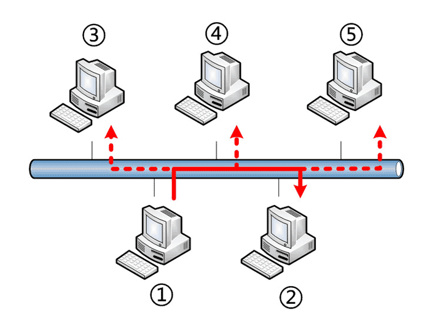

# 互联网协议入门
> GitHub@[orca-j35](https://github.com/orca-j35)，所有笔记均托管于 [python_notes](https://github.com/orca-j35/python_notes) 仓库
>
> 参考:
>
> - [互联网协议入门（一）](http://www.ruanyifeng.com/blog/2012/05/internet_protocol_suite_part_i.html)
> - [互联网协议入门（二） ](http://www.ruanyifeng.com/blog/2012/06/internet_protocol_suite_part_ii.html)

## 五层模型

如何分层有不同的模型，有的模型分七层，有的分四层。阮一峰老师觉得，把互联网分成五层，比较容易解释，如下:

越下面的层，越靠近硬件；越上面的层，越靠近用户。

每一层都有都有其特定功能，为了实现这些功能，就需要大家共同遵守某些规则。这些被大家共同遵守的规则便是"协议(*protocol*)"。互联网的每一次都定义了很多协议，这些协议被统称为"互联网协议族(Internet Protocol Suite)"。

## 实体层

实体层(Physical Layer)也称物理层，描述了硬件的物理连接方法，主要规定了网络的一些电气特性，作用是负责传送电信号，比如高电平表示 1，低电平表示 0。

## 连接层

"连接层"位于"实体层"上方，规定了电信号的排序和分组方式。

要想使实体层中的电信号携带有意义的信息，我们便需要规定电信号的排序方式，这样才能按照特定顺序解读出电信号的含义，这便是"连接层"的功能。

### 以太网协议

[以太网](https://zh.wikipedia.org/wiki/%E4%BB%A5%E5%A4%AA%E7%BD%91)(*Ethernet*)协议便是一种典型的连接层协议。

以太网协议将由一组电信号构成的数据包叫做"帧(Frame)"，每一帧由标头(*Head*)和数据(*Data*)。

"标头"包含数据包的一些说明项，比如发送者、接受者、数据类型等等；"数据"则是数据包的具体内容。

"标头"的长度，固定为18字节。"数据"的长度，最短为46字节，最长为1500字节。因此，整个"帧"最短为64字节，最长为1518字节。如果数据很长，就必须分割成多个帧进行发送。

#### MAC 地址

上面提到，以太网数据包的"标头"，包含了发送者和接受者的信息。那么，发送者和接受者是如何标识呢？

以太网规定，连入网络的所有设备，都必须具有"网卡"接口。数据包必须是从一块网卡，传送到另一块网卡。网卡的地址，就是数据包的发送地址和接收地址，这叫做MAC地址。

每块网卡出厂的时候，都有一个全世界独一无二的MAC地址，长度是48个二进制位，通常用12个十六进制数表示。前6个十六进制数是厂商编号，后6个是该厂商的网卡流水号。有了MAC地址，就可以定位网卡和数据包的路径了。

#### 广播

虽然每块网卡都有自己的 MAC 地址，那么 A 网卡又是如何知道 B 网卡的 MAC 地址的喃？

答案是使用 ARP 协议来解决这个问题。ARP 留到后面介绍，这里只需要知道，以太网数据包必须知道接收方的MAC地址，然后才能发送。

当 A 网卡知道 B 网卡的 MAC 地址后，系统怎样才能保证把数据从 A 准确送到 B 喃？

答案是以太网会采用广播的方式，向本网络中所有网卡发送数据信息，让计算机自行判断是否是接收方。

上图中，1号计算机向2号计算机发送一个数据包，同一个子网络的3号、4号、5号计算机都会收到这个包。它们读取这个包的"标头"，找到接收方的MAC地址，然后与自身的MAC地址相比较，如果两者相同，就接受这个包，做进一步处理，否则就丢弃这个包。这种发送方式就叫做"广播"(*broadcasting*)。

有了数据包的定义、网卡的MAC地址、广播的发送方式，"链接层"就可以在多台计算机之间传送数据了。

## 网络层

