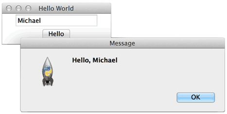

# 0x18 图形界面

Python 支持多种图形界面的第三方库，包括：Tk/ wxWidgets/ Qt/ GTK 等

Python自带的库支持 Tk 的 Tkinter。因此，使用Tkinter，无需安装任何包，就可以直接使用。

## Tkinter

我们来梳理一下概念：

我们编写的Python代码会调用内置的Tkinter，Tkinter封装了访问Tk的接口；
Tk是一个图形库，支持多个操作系统，使用Tcl语言开发；
Tk会调用操作系统提供的本地GUI接口，完成最终的GUI。
所以，我们的代码只需要调用Tkinter提供的接口就可以了。

### 第一个GUI程序

使用Tkinter十分简单，我们来编写一个GUI版本的“Hello, world!”。

第一步是导入Tkinter包的所有内容：

```
from tkinter import *
```

第二步是从`Frame`派生一个`Application`类，这是所有Widget的父容器：

```
class Application(Frame):
    def __init__(self, master=None):
        Frame.__init__(self, master)
        self.pack()
        self.createWidgets()#在初始化时会自动运行

    def createWidgets(self):
        self.helloLabel = Label(self, text='Hello, world!')
        self.helloLabel.pack()
        self.quitButton = Button(self, text='Quit', command=self.quit)
        self.quitButton.pack()
```

在GUI中，每个Button、Label、输入框等，都是一个Widget。**Frame则是可以容纳其他Widget的Widget**，所有的Widget组合起来就是一棵树。

`pack()`方法把Widget加入到父容器中，并实现布局。`pack()`是最简单的布局，`grid()`可以实现更复杂的布局。

在`createWidgets()`方法中，我们创建一个`Label`和一个`Button`，当Button被点击时，触发`self.quit()`使程序退出。

第三步，实例化`Application`，并启动消息循环：

```
app = Application()
# 设置窗口标题:
app.master.title('Hello World')
# 主消息循环:
app.mainloop()
```

GUI程序的主线程负责监听来自操作系统的消息，并依次处理每一条消息。因此，如果消息处理非常耗时，就需要在新线程中处理。

运行这个GUI程序，可以看到下面的窗口：


点击“Quit”按钮或者窗口的“x”结束程序。

### 输入文本

我们再对这个GUI程序改进一下，加入一个文本框，让用户可以输入文本，然后点按钮后，弹出消息对话框。

```
from tkinter import *
import tkinter.messagebox as messagebox

class Application(Frame):
    def __init__(self, master=None):
        Frame.__init__(self, master)
        self.pack()
        self.createWidgets()

    def createWidgets(self):
        self.nameInput = Entry(self)
        self.nameInput.pack()
        self.alertButton = Button(self, text='Hello', command=self.hello)
        self.alertButton.pack()

    def hello(self):
        name = self.nameInput.get() or 'world'
        messagebox.showinfo('Message', 'Hello, %s' % name)

app = Application()
# 设置窗口标题:
app.master.title('Hello World')
# 主消息循环:
app.mainloop()
```

当用户点击按钮时，触发`hello()`，通过`self.nameInput.get()`获得用户输入的文本后，使用`tkMessageBox.showinfo()`可以弹出消息对话框。

程序运行结果如下：



Python内置的Tkinter可以满足基本的GUI程序的要求，如果是非常复杂的GUI程序，建议用操作系统原生支持的语言和库来编写。

## 图形软件 Graphical Software

>   Suppose you want to create your own graphical programs using Python. This can be done using a GUI (Graphical User Interface) library with their Python bindings. Bindings are what allow you to write programs in Python and use the libraries which are themselves written in C or C++ or other languages.

假设您想要使用 Python 创建自己的图形程序。这可以使用 Python 绑定的GUI（图形用户界面）库来完成。 绑定是允许你使用 Python 编写程序，并使用本身用 C 或 C ++ 或其他语言编写的库。

There are lots of choices for GUI using Python:

-   Kivy

    -   [http://kivy.org](http://kivy.org/)

-   PyGTK

    -   This is the Python binding for the GTK+ toolkit which is the foundation upon which GNOME is built. GTK+ has many quirks in usage but once you become comfortable, you can create GUI apps fast. The Glade graphical interface designer is indispensable. The documentation is yet to improve. GTK+ works well on GNU/Linux but its port to Windows is incomplete. You can create both free as well as proprietary software using GTK+. To get started, read the [PyGTK tutorial](http://www.pygtk.org/tutorial.html).

        这是 GTK + 工具包的Python绑定，它是构建 GNOME 的基础。 GTK +有许多奇怪的使用，但一旦你适应了，你可以快速创建GUI应用程序。 Glade 图形界面设计师是不可或缺的。 文档还没有完善。 GTK +在GNU / Linux上运行良好，但它对Windows的端口不完整。 您可以使用GTK +创建免费和专有软件。 要开始，请阅读PyGTK教程。

-   PyQt

    -   This is the Python binding for the Qt toolkit which is the foundation upon which the KDE is built. Qt is extremely easy to use and very powerful especially due to the Qt Designer and the amazing Qt documentation. PyQt is free if you want to create open source (GPL'ed) software and you need to buy it if you want to create proprietary closed source software. Starting with Qt 4.5 you can use it to create non-GPL software as well. To get started, read about [PySide](http://qt-project.org/wiki/PySide).

        这是 Qt 工具包的Python绑定，它是构建KDE的基础。 Qt是非常容易使用，非常强大，特别是配合 Qt Designer 和出色的 Qt 文档。 PyQt 是免费的，如果你想创建开源（GPL'ed）的软件，如果你想创建专有的封闭源代码软件，则需要购买它。 从Qt 4.5开始，您也可以使用它来创建非 GPL 软件。 要开始，请阅读PySide。

-   wxPython

    -   This is the Python bindings for the wxWidgets toolkit. wxPython has a learning curve associated with it. However, it is very portable and runs on GNU/Linux, Windows, Mac and even embedded platforms. There are many IDEs available for wxPython which include GUI designers as well such as [SPE (Stani's Python Editor)](http://spe.pycs.net/) and the [wxGlade](http://wxglade.sourceforge.net/) GUI builder. You can create free as well as proprietary software using wxPython. To get started, read the [wxPython tutorial](http://zetcode.com/wxpython/).

        这是 wxWidgets 工具包的Python绑定。 wxPython有一个与之相关的学习曲线。 但是，它是非常便携，运行在GNU / Linux，Windows，Mac甚至嵌入式平台。 有许多可用于wxPython的IDE，包括GUI设计器，例如SPE（Stani的Python编辑器）和wxGlade GUI构建器。 您可以使用wxPython创建免费和专有软件。 要开始，请阅读wxPython教程。

-   PyKDE

-   PyGUI

-   Libavg

---

这一段文字参考时要小心阅读。

以下是本书更早的版本中对TKInter 的描述：

TkInter 是现存最老的GUI工具包之一。如果你使用过IDLE，它就是一个TkInter程序。
在http://www.pythonware.com/library/tkinter/introduction/index.htm上的TkInter文档是十分透彻的。TkInter具备可移植性，可以在Linux/Unix和Windows下工作。重要的是，TkInter是标准Python发行版的一部分。
要获取更多选择，请参阅Python.org上的GUI编程wiki页。

Summary of GUI Tools

>   For more choices, see the [GuiProgramming wiki page at the official python website](http://www.python.org/cgi-bin/moinmoin/GuiProgramming).
>
>   Unfortunately, there is no one standard GUI tool for Python. I suggest that you choose one of the above tools depending on your situation. The first factor is whether you are willing to pay to use any of the GUI tools. The second factor is whether you want the program to run only on Windows or on Mac and GNU/Linux or all of them. The third factor, if GNU/Linux is a chosen platform, is whether you are a KDE or GNOME user on GNU/Linux.
>
>   For a more detailed and comprehensive analysis, see Page 26 of the ['The Python Papers, Volume 3, Issue 1' (PDF)](http://archive.pythonpapers.org/ThePythonPapersVolume3Issue1.pdf).

更多选择，请参阅官方python网站上的GuiProgramming wiki页面。

不幸的是，没有一个标准的GUI工具的Python。 我建议您根据您的情况选择上述工具之一。 第一个因素是你是否愿意支付使用任何GUI工具。 第二个因素是你想让程序只运行在Windows上还是在Mac和GNU / Linux或所有这些。 第三个因素，如果GNU / Linux是一个选定的平台，则是您是GNU / Linux上的KDE或GNOME用户。

有关更详细和全面的分析，请参阅“Python论文，第3卷，第1期”（PDF）的第26页。

----